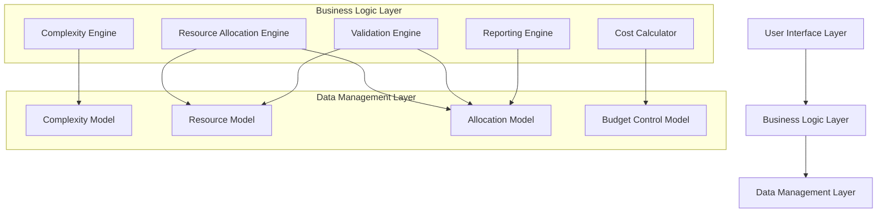

# Design Document: Business Logic Optimization

## Overview

This design addresses critical business logic optimization for the project management and resource allocation application. The optimization focuses on three main areas:

1. **Fixing the broken complexity model** - Replace arbitrary "hours" multipliers with actual effort-based calculations
2. **Implementing tier-based skill adjustments** - Leverage the existing 5-tier system for realistic effort estimation
3. **Enhancing resource and budget management** - Add capacity tracking, over-allocation detection, and budget enforcement

The current working days calculation is already industry-standard correct and will be preserved. The existing tier system (1=Junior to 5=Principal) provides an excellent foundation for skill-based adjustments.

### Additional User-Requested Enhancements

Based on user feedback, the design also incorporates:

1. **SLA Time Mapping to Priority** - Establish time-based service level agreements based on task priority
2. **Selective Complexity Calculation** - Apply complexity calculations only to Project tasks, not Support/Maintenance
3. **Enhanced UI/UX Improvements** - Color alignment for member load status, modal improvements, terminology updates
4. **Dashboard and Search Enhancements** - Improved date filtering and demand number search for Support issues
5. **Phase-Based Duration Calculation** - Calculate task spans from allocation phase to completion phase
6. **Capacity Terminology Update** - Change "At Capacity" to "Over Capacity" for >100% utilization

## Architecture

The optimization follows a layered architecture approach:



### Key Architectural Principles

1. **Separation of Concerns**: Effort calculation, cost calculation, and resource management are distinct responsibilities
2. **Backward Compatibility**: Existing allocations continue to work during transition
3. **Performance Optimization**: Selective recalculation and memoization for large datasets
4. **Extensibility**: Multi-factor complexity scoring can be enhanced without breaking existing functionality

## Components and Interfaces

### 1. Enhanced Complexity Engine

**Purpose**: Replace the broken complexity model with effort-based calculations

**Key Components**:
- `ComplexityCalculator`: Computes actual effort hours based on multiple factors
- `SkillAdjustmentEngine`: Applies tier-based skill multipliers
- `ComplexityValidator`: Ensures complexity parameters are valid

**Interface**:
```javascript
interface ComplexityEngine {
  calculateEffort(complexity: ComplexityLevel, resourceTier: number, options?: EffortOptions): EffortResult;
  validateComplexity(complexityData: ComplexityData): ValidationResult;
  getComplexityBreakdown(complexity: ComplexityLevel): ComplexityBreakdown;
}

interface EffortResult {
  baseEffortHours: number;
  adjustedEffortHours: number;
  skillMultiplier: number;
  complexityMultiplier: number;
  riskMultiplier: number;
  breakdown: EffortBreakdown;
}
```

### 2. Resource Allocation Engine

**Purpose**: Manage resource capacity, detect over-allocation, and support percentage-based assignments

**Key Components**:
- `CapacityTracker`: Monitors resource utilization across all allocations
- `AllocationValidator`: Validates resource availability and constraints
- `ConflictDetector`: Identifies scheduling and capacity conflicts

**Interface**:
```javascript
interface ResourceAllocationEngine {
  validateAllocation(allocationRequest: AllocationRequest): ValidationResult;
  detectOverAllocation(resourceId: string, allocations: Allocation[]): OverAllocationResult;
  calculateUtilization(resourceId: string, timeRange: DateRange): UtilizationResult;
  supportPercentageAllocation(allocation: Allocation, percentage: number): AllocationResult;
}

interface OverAllocationResult {
  isOverAllocated: boolean;
  currentUtilization: number;
  maxCapacity: number;
  overAllocationAmount: number;
  conflictingAllocations: string[];
}
```

### 3. Enhanced Cost Calculator

**Purpose**: Implement proper cost calculations using actual effort hours and tier-adjusted rates

**Key Components**:
- `CostCalculator`: Computes project costs using the new formula
- `RateAdjuster`: Applies overhead and inflation factors to base rates
- `BudgetEnforcer`: Validates budget capacity and enforces limits

**Interface**:
```javascript
interface CostCalculator {
  calculateProjectCost(effort: EffortResult, resource: Resource, options?: CostOptions): CostResult;
  calculateDuration(effortHours: number, allocationPercentage: number): DurationResult;
  validateBudgetCapacity(costCenterId: string, projectedCost: number): BudgetValidationResult;
}

interface CostResult {
  totalCost: number;
  effortHours: number;
  durationDays: number;
  hourlyRate: number;
  breakdown: CostBreakdown;
}
```

### 4. Validation Engine

**Purpose**: Provide comprehensive pre-allocation validation

**Key Components**:
- `ResourceValidator`: Checks resource availability and skill match
- `BudgetValidator`: Validates budget capacity and constraints
- `ScheduleValidator`: Ensures timeline feasibility

**Interface**:
```javascript
interface ValidationEngine {
  validateAllocationCreation(allocationData: AllocationRequest): Promise<ValidationResult[]>;
  validateResourceAvailability(resourceId: string, dateRange: DateRange): Promise<AvailabilityResult>;
  validateBudgetCapacity(costCenterId: string, estimatedCost: number): Promise<BudgetResult>;
  validateSkillMatch(resourceId: string, taskRequirements: SkillRequirement[]): Promise<SkillMatchResult>;
}
```

### 7. UI/UX Enhancement Engine

**Purpose**: Manage UI improvements including color schemes, modals, and terminology

**Key Components**:
- `ColorSchemeManager`: Standardizes member load status colors
- `ModalManager`: Handles date picker and other modal implementations
- `TerminologyManager`: Updates capacity-related terminology

**Interface**:
```javascript
interface UIEnhancementEngine {
  getLoadStatusColor(utilizationPercentage: number): ColorScheme;
  renderDatePickerModal(options: DatePickerOptions): ModalComponent;
  getCapacityStatusText(utilizationPercentage: number): string; // "Over Capacity" for >100%
}
```

### 8. Dashboard and Search Engine

**Purpose**: Enhanced dashboard filtering and search capabilities

**Key Components**:
- `DateFilterManager`: Improved date filtering for dashboard views
- `DemandSearchEngine`: Search functionality for Support issue demand numbers
- `PhaseCalculator`: Calculate task spans from allocation to completion phases

**Interface**:
```javascript
interface DashboardEngine {
  filterByDateRange(allocations: Allocation[], dateRange: DateRange): Allocation[];
  searchByDemandNumber(issues: SupportIssue[], demandNumber: string): SupportIssue[];
  calculatePhaseSpan(allocation: Allocation, completionPhase: Phase): TimeSpan;
}
```

## Data Models

### Enhanced Complexity Model

```javascript
interface EnhancedComplexity {
  level: 'low' | 'medium' | 'high' | 'sophisticated';
  label: string;
  baseEffortHours: number;        // Actual work effort (40, 120, 320, 640)
  baselineDays: number;           // Duration at 100% allocation for mid-tier
  complexityMultiplier: number;   // Effort adjustment factor (0.8, 1.0, 1.5, 2.5)
  riskFactor: number;            // Risk multiplier (1.0, 1.2, 1.8, 2.5)
  skillSensitivity: number;      // How much tier level affects this complexity (0.3, 0.5, 0.8, 1.2)
  
  // Multi-factor scoring (for advanced complexity)
  technicalComplexity?: number;  // 1-10 scale
  businessComplexity?: number;   // 1-10 scale
  integrationPoints?: number;    // Count of external dependencies
  unknownRequirements?: number;  // Percentage of unclear requirements
}
```

### Enhanced Resource Model

```javascript
interface EnhancedResource {
  // Existing fields preserved
  id: string;
  name: string;
  tierLevel: number;             // 1=Junior, 2=Mid, 3=Senior, 4=Lead, 5=Principal
  costTierId: string;
  
  // New capacity management fields
  maxCapacity: number;           // e.g., 1.0 = 100% capacity
  currentUtilization: number;    // calculated in real-time
  overAllocationThreshold: number; // e.g., 1.2 = 120% max
  
  // Enhanced skill tracking
  skillAreas: string[];          // ['React', 'Node.js', 'AWS']
  performanceMetrics: {
    averageTaskCompletion: number; // historical performance
    qualityScore: number;         // 1-10 scale
    velocityTrend: 'improving' | 'stable' | 'declining';
  };
  
  // Availability management
  availabilityCalendar: AvailabilityPeriod[];
}

interface AvailabilityPeriod {
  startDate: string;
  endDate: string;
  availabilityPercentage: number; // 0.0 to 1.0
  reason?: string;               // 'vacation', 'training', 'other-project'
}
```

### Enhanced Allocation Model

```javascript
interface EnhancedAllocation {
  // Existing fields preserved
  id: string;
  resource: string;
  project: string;
  phase: string;
  task: string;
  complexity: string;
  
  // New allocation management fields
  allocationPercentage: number;  // 0.0 to 1.0 (10% to 100%)
  effectiveHours: number;        // calculated from percentage
  
  // Enhanced effort tracking
  effort: {
    baseEffortHours: number;
    adjustedEffortHours: number;
    skillMultiplier: number;
    complexityMultiplier: number;
    riskMultiplier: number;
  };
  
  // Enhanced planning data
  plan: {
    effortHours: number;         // actual work effort
    durationDays: number;        // calendar duration
    costProject: number;         // total project cost
    costMonthly: number;         // monthly cost impact
    startDate: string;
    endDate: string;
  };
  
  // Validation and conflict tracking
  validationStatus: {
    isValid: boolean;
    warnings: string[];
    conflicts: string[];
  };
  
  // Dependencies and constraints
  dependencies: string[];        // other allocation IDs
  skillRequirements: string[];
  riskLevel: 'low' | 'medium' | 'high';
}
```

### Enhanced Cost Center Model

```javascript
interface EnhancedCostCenter {
  // Existing fields preserved
  id: string;
  name: string;
  monthlyBudget: number;
  yearlyBudget: number;
  actualMonthlyCost: number;
  actualYearlyCost: number;
  
  // New budget management fields
  budgetEnforcement: 'strict' | 'warning' | 'none';
  overBudgetThreshold: number;   // percentage over budget allowed
  
  // Enhanced tracking
  projectedSpend: number;        // including pending allocations
  remainingBudget: number;       // available for new allocations
  utilizationPercentage: number; // current budget utilization
  
  // Audit and history
  budgetHistory: BudgetSnapshot[];
  lastUpdated: string;
}

interface BudgetSnapshot {
  date: string;
  monthlyBudget: number;
  actualSpend: number;
  projectedSpend: number;
  allocationCount: number;
}
```

## Correctness Properties

*A property is a characteristic or behavior that should hold true across all valid executions of a system—essentially, a formal statement about what the system should do. Properties serve as the bridge between human-readable specifications and machine-verifiable correctness guarantees.*

### Property 1: Effort-Based Complexity Model Correctness
*For any* task complexity level, the complexity model should contain actual effort hours (not arbitrary multipliers) and all required parameters (complexity multipliers, risk factors, skill sensitivity) should be properly defined and mathematically consistent.
**Validates: Requirements 1.1, 1.4**

### Property 2: Effort-Duration Separation
*For any* allocation with effort hours and allocation percentage, the duration calculation should follow the formula: Duration Days = Effort Hours ÷ (Allocation Percentage × 8 hours/day), ensuring proper separation between effort and timeline.
**Validates: Requirements 1.2, 3.3, 6.2, 6.3**

### Property 3: Tier-Based Skill Adjustment Correctness
*For any* resource with a tier level (1-5) assigned to any task complexity, the effort calculation should apply appropriate skill multipliers where Junior (tier 1) requires more effort than Senior (tier 3), and the adjustment magnitude should respect the complexity's skill sensitivity factor.
**Validates: Requirements 2.1, 2.3, 2.4, 2.5**

### Property 4: Cost Calculation Formula Correctness
*For any* allocation, the total cost should equal Actual Effort Hours × Tier-Adjusted Hourly Rate, where actual effort hours include all applied multipliers (complexity, skill, risk) and the hourly rate maintains the existing monthly→daily→hourly conversion structure.
**Validates: Requirements 3.1, 3.2, 3.5**

### Property 5: Cost Breakdown Completeness
*For any* cost calculation, the breakdown should include all contributing factors (base hours, skill multiplier, complexity multiplier, risk multiplier, hourly rate) and the sum of components should equal the total calculated cost.
**Validates: Requirements 3.4**

### Property 6: Resource Utilization Tracking Accuracy
*For any* resource, the current utilization should equal the sum of allocation percentages across all active allocations, and over-allocation should be flagged when utilization exceeds the resource's configurable threshold.
**Validates: Requirements 4.1, 4.2, 4.3**

### Property 7: Over-Allocation Prevention
*For any* new allocation request, when strict enforcement is enabled and the allocation would cause over-allocation, the system should prevent the allocation and provide clear feedback about the capacity conflict.
**Validates: Requirements 4.5**

### Property 8: Budget Enforcement Correctness
*For any* allocation request, the system should validate that projected spend (current spend + new allocation cost) does not exceed available budget, and enforcement behavior should match the configured mode (strict/warning/none).
**Validates: Requirements 5.1, 5.2, 5.3, 5.4**

### Property 9: Allocation Percentage Validation
*For any* resource, the system should accept allocation percentages between 0.1 and 1.0, and the total of all allocation percentages should not exceed the resource's maximum capacity when validation is enabled.
**Validates: Requirements 6.1, 6.5**

### Property 10: Percentage-Based Allocation Calculations
*For any* allocation with a percentage assignment, both the allocated percentage and effective working hours should be tracked, and they should maintain the mathematical relationship: Effective Hours = Base Effort Hours ÷ Allocation Percentage.
**Validates: Requirements 6.4**

### Property 11: Comprehensive Resource Validation
*For any* allocation request, the validation should consider resource availability, existing allocations, leave schedules, capacity limits, skill matching, and workload constraints, providing detailed feedback for any conflicts or violations.
**Validates: Requirements 7.1, 7.2, 7.3, 7.4, 7.5**

### Property 12: Multi-Factor Complexity Scoring
*For any* task with multi-factor complexity scoring, the system should support technical complexity, business complexity, and risk factors (1-10 scale each), combine them into a composite score, and apply different skill sensitivities based on complexity type.
**Validates: Requirements 8.1, 8.2, 8.3, 8.4**

### Property 13: Working Days Calculation Preservation
*For any* date range, the working days calculation should maintain the existing Indonesia-specific holiday calendar logic, provide detailed breakdowns (calendar days, weekends, holidays, working days), and support overhead factors in rate calculations.
**Validates: Requirements 9.1, 9.2, 9.4**

### Property 14: Performance Optimization Correctness
*For any* system operation, selective recalculation should only affect allocations that depend on changed values, memoized calculations should return consistent results for identical inputs, and memory optimization should avoid storing redundant cost center data in allocations.
**Validates: Requirements 10.2, 10.3, 10.5**

### Property 15: Reporting Data Accuracy
*For any* generated report, resource utilization calculations should be accurate, cost breakdowns should include all complexity and skill factors, variance tracking should correctly compare estimated vs actual values, and portfolio aggregations should properly sum across projects.
**Validates: Requirements 11.1, 11.2, 11.3, 11.4**

### Property 16: Backward Compatibility Preservation
*For any* existing allocation, the transition to the new complexity model should maintain calculation accuracy and data integrity, ensuring that historical allocations continue to function correctly with the enhanced system.
**Validates: Requirements 1.5**

### Property 17: SLA Priority Mapping Correctness
*For any* task with a defined priority level, the system should map appropriate SLA time requirements (response, resolution, escalation times) and track compliance against these service level agreements.
**Validates: User Requirement - SLA Time Mapping to Priority**

### Property 18: Selective Complexity Application
*For any* task, complexity calculations should only be applied to Project tasks, while Support and Maintenance tasks should use simple time estimates, ensuring appropriate calculation methods based on task type.
**Validates: User Requirement - Remove Complexity Calculation except for Project Task**

### Property 19: Phase-Based Duration Calculation
*For any* allocation with a task allocation phase selected, the system should calculate the time span from the allocation phase until the completion phase, providing accurate phase-based timeline estimates.
**Validates: User Requirement - Calculate span until phase Completed**

### Property 20: Capacity Status Terminology Accuracy
*For any* resource with utilization greater than 100%, the system should display "Over Capacity" status instead of "At Capacity", providing clear indication of over-allocation situations.
**Validates: User Requirement - Update At Capacity word into Over Capacity**

### Property 21: Dashboard Date Filter Functionality
*For any* date range selection on the dashboard, the filtering should accurately display allocations within the specified period and provide intuitive date picker modal functionality.
**Validates: User Requirement - Update Date Filter Function on Dashboard View**

### Property 22: Demand Number Search Capability
*For any* Support issue with a demand number, the search functionality should allow finding related issues by demand number, supporting both exact matches and related demand lookups.
**Validates: User Requirement - Add Search Demand Number for Support Issue**

## Error Handling

### Validation Error Handling

**Input Validation Errors**:
- Invalid complexity parameters → Return detailed validation messages
- Invalid tier levels → Default to mid-tier (level 2) with warning
- Invalid allocation percentages → Reject with range specification (0.1-1.0)
- Missing required fields → Return specific field requirements

**Business Logic Errors**:
- Over-allocation attempts → Prevent with capacity conflict details
- Budget exceeded → Block or warn based on enforcement mode
- Skill mismatch → Flag with skill gap analysis
- Resource unavailable → Provide availability alternatives

**Calculation Errors**:
- Division by zero in duration calculations → Handle zero allocation percentage gracefully
- Negative effort hours → Validate and reject invalid complexity configurations
- Invalid date ranges → Provide clear date validation messages
- Missing cost data → Use fallback rates with warnings

### Error Recovery Strategies

**Graceful Degradation**:
- If tier-based calculations fail → Fall back to baseline effort estimates
- If budget validation fails → Allow with warnings in non-strict mode
- If complexity data is missing → Use default complexity parameters
- If working days calculation fails → Use standard 20 days/month fallback

**Data Consistency**:
- Transaction rollback for failed allocation creation
- Automatic recalculation when dependencies are restored
- Audit trail for all error conditions and recovery actions
- Validation state tracking for partial allocation data

## Testing Strategy

### Dual Testing Approach

The testing strategy employs both unit tests and property-based tests as complementary approaches:

**Unit Tests Focus**:
- Specific examples demonstrating correct behavior
- Edge cases and boundary conditions
- Error conditions and exception handling
- Integration points between components
- Regression tests for critical bug fixes

**Property Tests Focus**:
- Universal properties that hold for all inputs
- Comprehensive input coverage through randomization
- Mathematical relationships and invariants
- Business rule enforcement across all scenarios
- Performance characteristics under varied loads

### Property-Based Testing Configuration

**Testing Framework**: Use fast-check (JavaScript/TypeScript) for property-based testing
**Test Configuration**: Minimum 100 iterations per property test
**Test Tagging**: Each property test must reference its design document property

**Example Property Test Structure**:
```javascript
// Feature: business-logic-optimization, Property 3: Tier-Based Skill Adjustment Correctness
fc.assert(fc.property(
  fc.record({
    tierLevel: fc.integer(1, 5),
    complexity: fc.constantFrom('low', 'medium', 'high', 'sophisticated'),
    baseEffort: fc.integer(1, 1000)
  }),
  (data) => {
    const result = calculateTierAdjustedEffort(data.complexity, data.tierLevel, data.baseEffort);
    
    // Junior (tier 1) should require more effort than Senior (tier 3)
    const juniorResult = calculateTierAdjustedEffort(data.complexity, 1, data.baseEffort);
    const seniorResult = calculateTierAdjustedEffort(data.complexity, 3, data.baseEffort);
    
    return juniorResult.adjustedEffortHours >= seniorResult.adjustedEffortHours;
  }
), { numRuns: 100 });
```

### Unit Testing Strategy

**Critical Unit Tests**:
- Complexity model data structure validation
- Tier multiplier calculation accuracy
- Cost formula implementation correctness
- Budget validation logic
- Over-allocation detection algorithms
- Working days calculation edge cases
- Error handling and recovery scenarios

**Integration Tests**:
- End-to-end allocation creation workflow
- Cross-component data consistency
- Performance under realistic data volumes
- Backward compatibility with existing data
- Multi-user concurrent access scenarios

### Test Data Management

**Test Data Categories**:
- **Synthetic Data**: Generated test allocations, resources, and cost centers
- **Historical Data**: Anonymized production data for regression testing
- **Edge Case Data**: Boundary conditions and unusual scenarios
- **Performance Data**: Large datasets for scalability testing

**Data Generation Strategy**:
- Property-based test generators for comprehensive coverage
- Realistic test data that mirrors production patterns
- Controlled test scenarios for specific business rules
- Performance test data with varying scales and complexity