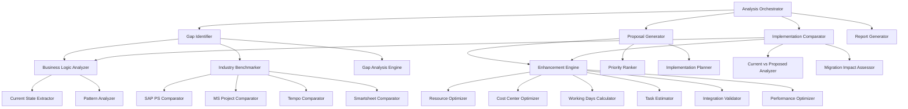

# Design Document: Business Logic Optimization

## Overview

This design outlines a comprehensive analysis and optimization framework for the business logic in a project management and resource allocation application. The system will systematically evaluate current implementation patterns against industry best practices from enterprise solutions (SAP Project System, Microsoft Project, Tempo, Smartsheet) and generate specific improvement recommendations.

The analysis focuses on nine key areas: business logic patterns, industry benchmarking, resource allocation algorithms, cost center management, task complexity estimation, working days calculation, data integration, performance optimization, and enhancement proposal generation.

## Architecture

The optimization system follows a modular analysis architecture with the following components:



## Components and Interfaces

### Business Logic Analyzer

**Purpose**: Extracts and analyzes current implementation patterns

**Key Methods**:
- `extractResourceAllocationLogic()`: Analyzes current allocation algorithms
- `analyzeCostCenterHierarchy()`: Maps cost center structure and rules
- `evaluateTaskCreationWorkflow()`: Reviews task creation and estimation logic
- `assessIntegrationPatterns()`: Identifies entity relationships and data flows

**Outputs**: Current state documentation with code patterns, business rules, and architectural decisions

### Industry Benchmarker

**Purpose**: Compares implementation against enterprise standards

**Key Methods**:
- `compareSAPProjectSystem()`: Evaluates against SAP PS WBS and activity-based costing
- `compareMicrosoftProject()`: Assesses resource pools, leveling, and over-allocation detection
- `compareTempo()`: Reviews time/cost/capacity strategic triad approach
- `compareSmartsheet()`: Analyzes cross-project visibility and resource management

**Outputs**: Detailed benchmark analysis with specific feature gaps and opportunities

### Working Days Calculator

**Purpose**: Implements industry-standard working days calculation

**Key Methods**:
- `calculateWorkingDays(startDate, endDate, holidayCalendar)`: Core business days calculation
- `excludeWeekends()`: Filters out Saturday/Sunday from date ranges
- `applyHolidayCalendar(region, businessUnit)`: Applies configurable holiday exclusions
- `adjustForLeave(resourceId, dateRange)`: Accounts for vacation and sick leave
- `integrateWithComplexity(workingDays, complexityFactor)`: Applies complexity only to working days

**Business Rules**:
- Monday-Friday are standard working days
- Configurable holiday calendars per region/business unit
- Leave days (vacation, sick) excluded from availability calculations
- Complexity factors applied only to actual working days
- Daily rates calculated based on working days per period (not calendar days)

### Resource Allocation Engine

**Purpose**: Implements advanced resource allocation with over-allocation detection

**Key Methods**:
- `detectOverAllocation(resourceId, timeRange)`: Identifies resource conflicts
- `calculatePercentageAllocations()`: Manages percentage-based assignments
- `levelResources(projectSet)`: Automated resource leveling across projects
- `distinguishResourceTypes()`: Handles internal vs external resource cost models
- `trackUtilization()`: Real-time utilization monitoring

**Algorithms**:
- **Over-allocation Detection**: Continuous monitoring of resource assignments vs capacity
- **Resource Leveling**: Automatic task rescheduling to resolve conflicts
- **Utilization Optimization**: Balancing workload across available resources
- **Cost Calculation**: Different models for internal (salary-based) vs external (rate-based) resources

### Cost Center Manager

**Purpose**: Enhanced hierarchical cost center management with enterprise controls

**Key Methods**:
- `manageBudgetHierarchy()`: Cascading budget controls with rollup calculations
- `categorizeCosts(expense, type)`: CAPEX vs OPEX classification
- `enforceBudgetLimits()`: Prevent over-budget allocations with approval workflows
- `generateFinancialReports()`: Real-time budget vs actual reporting
- `processBudgetTransfers()`: Inter-cost-center transfers with audit trails

**Business Rules**:
- Hierarchical budget rollup from child to parent cost centers
- CAPEX/OPEX categorization with appropriate allocation rules
- Budget enforcement with configurable approval thresholds
- Audit trail for all budget modifications and transfers

### Task Complexity Estimator

**Purpose**: Advanced task estimation with multi-factor complexity scoring

**Key Methods**:
- `calculateComplexityScore(task)`: Multi-factor complexity analysis
- `adjustForSkillLevels(estimate, assignedResources)`: Skill-based estimate adjustment
- `trackEarnedValue()`: Earned value management calculations
- `maintainEstimateHistory()`: Historical tracking and variance analysis
- `forecastCompletion()`: Statistical completion date prediction

**Complexity Factors**:
- Technical complexity (technology stack, integration points)
- Business complexity (requirements clarity, stakeholder count)
- Resource complexity (skill requirements, availability)
- Risk factors (dependencies, unknowns)

### Implementation Comparator

**Purpose**: Compares current implementation against proposed optimizations

**Key Methods**:
- `mapCurrentBusinessLogic()`: Documents existing business logic across all functions
- `analyzeImplementationDifferences()`: Identifies specific changes between current and proposed logic
- `assessMigrationImpact()`: Evaluates data migration and compatibility requirements
- `generateComparisonReport()`: Creates side-by-side analysis of current vs proposed implementations
- `identifyAffectedFunctions()`: Maps which functions would be impacted by each optimization

**Analysis Areas**:
- **Current State Mapping**: Complete documentation of existing business rules, algorithms, and data flows
- **Change Impact Analysis**: Function-by-function comparison of current vs proposed implementations
- **Migration Path Planning**: Data migration requirements, API compatibility, and rollback strategies
- **Risk Assessment**: Identification of potential breaking changes and mitigation approaches

## Data Models

### Working Days Configuration
```typescript
interface WorkingDaysConfig {
  businessDays: DayOfWeek[];  // Default: [Monday, Tuesday, Wednesday, Thursday, Friday]
  holidayCalendars: HolidayCalendar[];
  leaveManagement: LeaveConfig;
}

interface HolidayCalendar {
  region: string;
  businessUnit?: string;
  holidays: Holiday[];
}

interface Holiday {
  date: Date;
  name: string;
  type: 'public' | 'company' | 'regional';
}
```

### Resource Allocation Model
```typescript
interface ResourceAllocation {
  resourceId: string;
  projectId: string;
  taskId?: string;
  allocationPercentage: number;
  startDate: Date;
  endDate: Date;
  workingDaysOnly: boolean;
  costCenterId: string;
  resourceType: 'internal' | 'external' | 'vendor';
}

interface ResourceCapacity {
  resourceId: string;
  totalCapacity: number;  // in working days or hours
  allocatedCapacity: number;
  availableCapacity: number;
  overAllocationThreshold: number;
}
```

### Enhanced Cost Center Model
```typescript
interface CostCenter {
  id: string;
  name: string;
  parentId?: string;
  budgetAmount: number;
  budgetType: 'CAPEX' | 'OPEX' | 'MIXED';
  budgetPeriod: 'monthly' | 'quarterly' | 'yearly';
  approvalThreshold: number;
  children: CostCenter[];
}

interface BudgetAllocation {
  costCenterId: string;
  allocatedAmount: number;
  actualSpent: number;
  commitments: number;
  availableBudget: number;
  lastUpdated: Date;
}
```

### Task Complexity Model
```typescript
interface TaskComplexity {
  taskId: string;
  technicalComplexity: number;  // 1-10 scale
  businessComplexity: number;   // 1-10 scale
  resourceComplexity: number;   // 1-10 scale
  riskFactor: number;          // 1-10 scale
  overallComplexity: number;   // calculated composite score
  estimateInWorkingDays: number;
  confidenceLevel: number;     // 0-100%
}
```

### Implementation Comparison Model
```typescript
interface CurrentImplementationMap {
  functionName: string;
  businessRules: BusinessRule[];
  algorithms: Algorithm[];
  dataFlows: DataFlow[];
  integrationPoints: IntegrationPoint[];
  performanceCharacteristics: PerformanceMetrics;
}

interface ProposedOptimization {
  targetFunction: string;
  currentImplementation: CurrentImplementationMap;
  proposedChanges: ImplementationChange[];
  migrationRequirements: MigrationRequirement[];
  compatibilityImpact: CompatibilityAssessment;
  riskAssessment: RiskAssessment;
}

interface ImplementationChange {
  changeType: 'algorithm' | 'business_rule' | 'data_model' | 'integration';
  currentApproach: string;
  proposedApproach: string;
  impactLevel: 'low' | 'medium' | 'high';
  breakingChange: boolean;
  migrationPath: string;
}
```

Now I need to use the prework tool to analyze the acceptance criteria before writing the Correctness Properties section:

<function_calls>
<invoke name="prework">
<parameter name="featureName">business-logic-optimization

## Correctness Properties

*A property is a characteristic or behavior that should hold true across all valid executions of a system—essentially, a formal statement about what the system should do. Properties serve as the bridge between human-readable specifications and machine-verifiable correctness guarantees.*

### Analysis and Benchmarking Properties

**Property 1: Complete Business Logic Extraction**
*For any* codebase containing resource allocation, cost center management, or task creation logic, the Business_Logic_Analyzer should extract and document all algorithms, business rules, hierarchical structures, and integration patterns without omission.
**Validates: Requirements 1.1, 1.2, 1.3, 1.4, 1.5**

**Property 2: Comprehensive Industry Benchmark Comparison**
*For any* current implementation feature set, the Gap_Identifier should evaluate against all relevant industry standards (SAP PS, Microsoft Project, Tempo, Smartsheet) and produce gap analysis containing specific benchmark comparisons and recommendations.
**Validates: Requirements 2.1, 2.2, 2.3, 2.4, 2.5**

### Resource Allocation Properties

**Property 3: Over-allocation Detection Accuracy**
*For any* resource with defined capacity and time period, when assignments exceed available capacity, the Resource_Allocation_Engine should detect and flag the over-allocation condition.
**Validates: Requirements 3.1**

**Property 4: Percentage Allocation Calculation Consistency**
*For any* resource allocation specified as a percentage, the Resource_Allocation_Engine should calculate the corresponding time units accurately and maintain consistency across all allocation calculations.
**Validates: Requirements 3.2**

**Property 5: Resource Type Cost Model Application**
*For any* resource allocation, the Resource_Allocation_Engine should apply the correct cost model (internal salary-based vs external rate-based) based on the resource type classification.
**Validates: Requirements 3.3**

**Property 6: Resource Leveling Conflict Resolution**
*For any* set of over-allocated resources across projects, the Resource_Allocation_Engine should produce a leveled schedule that resolves conflicts while minimizing project impact.
**Validates: Requirements 3.4**

**Property 7: Real-time Utilization Accuracy**
*For any* resource allocation change, the Resource_Allocation_Engine should immediately update utilization metrics to reflect the current state across all projects.
**Validates: Requirements 3.5**

### Cost Center Management Properties

**Property 8: Hierarchical Budget Rollup Consistency**
*For any* cost center hierarchy, budget changes at any level should correctly cascade and rollup to all parent levels, maintaining mathematical consistency.
**Validates: Requirements 4.1**

**Property 9: CAPEX/OPEX Categorization Accuracy**
*For any* expense or allocation, the Cost_Center_Manager should correctly categorize it as CAPEX or OPEX based on defined business rules and apply appropriate allocation methods.
**Validates: Requirements 4.2**

**Property 10: Budget Enforcement Integrity**
*For any* allocation request that would exceed available budget, the Cost_Center_Manager should either prevent the allocation or route it through the configured approval workflow.
**Validates: Requirements 4.3**

**Property 11: Real-time Financial Reporting Accuracy**
*For any* budget or allocation change, financial reports at all hierarchy levels should immediately reflect the updated budget vs actual values.
**Validates: Requirements 4.4**

**Property 12: Budget Transfer Audit Trail Completeness**
*For any* inter-cost-center budget transfer, the Cost_Center_Manager should create a complete audit trail containing all transfer details, approvals, and timestamps.
**Validates: Requirements 4.5**

### Task Estimation Properties

**Property 13: Multi-factor Complexity Scoring Consistency**
*For any* task with defined characteristics, the Task_Complexity_Estimator should calculate complexity scores using all relevant factors (technical, business, resource, risk) in a consistent manner.
**Validates: Requirements 5.1**

**Property 14: Skill-adjusted Effort Calculation**
*For any* task assignment, effort estimates should appropriately adjust based on assigned resource skill levels and availability patterns.
**Validates: Requirements 5.2**

**Property 15: Earned Value Management Calculation Accuracy**
*For any* task with progress updates, earned value calculations should follow standard EVM formulas (PV, EV, AC, SPI, CPI) correctly.
**Validates: Requirements 5.3**

**Property 16: Estimate History and Variance Tracking**
*For any* estimate adjustment, the Task_Complexity_Estimator should maintain complete historical records and calculate variance analysis accurately.
**Validates: Requirements 5.4**

**Property 17: Statistical Forecasting Model Application**
*For any* task with historical data, completion forecasts should use appropriate statistical models and provide confidence intervals.
**Validates: Requirements 5.5**

### Working Days Calculation Properties

**Property 18: Working Days Calculation Accuracy**
*For any* date range, the Working_Days_Calculator should exclude weekends, holidays, and leave days, applying complexity factors only to actual working days and calculating costs based on working day rates.
**Validates: Requirements 6.1, 6.2, 6.3, 6.4, 6.5**

**Property 19: Holiday Calendar Configuration Flexibility**
*For any* regional or business unit configuration, the Working_Days_Calculator should correctly apply the appropriate holiday calendar and handle multiple overlapping calendars.
**Validates: Requirements 6.6**

### Integration and Consistency Properties

**Property 20: Real-time Budget Impact Propagation**
*For any* resource allocation change, cost center budget impacts should be immediately reflected across all related entities and reports.
**Validates: Requirements 7.1**

**Property 21: Cascading Change Consistency**
*For any* cost center modification, all dependent allocations and tasks should be updated consistently to maintain data integrity.
**Validates: Requirements 7.2**

**Property 22: Creation Validation Completeness**
*For any* task creation request, the Integration_Validator should verify both resource availability and cost center budget capacity before allowing creation.
**Validates: Requirements 7.3**

**Property 23: Bulk Operation Transactional Integrity**
*For any* bulk operation affecting multiple entities, either all changes should succeed together or all should fail together, maintaining system consistency.
**Validates: Requirements 7.4**

**Property 24: Event-driven Update Consistency**
*For any* system event, all dependent components should receive updates and maintain consistent state in real-time.
**Validates: Requirements 7.5**

### Performance Optimization Properties

**Property 25: Performance Bottleneck Identification**
*For any* calculation-intensive operation, the Performance_Optimizer should identify bottlenecks and provide specific optimization recommendations with expected improvements.
**Validates: Requirements 8.1, 8.5**

**Property 26: Caching Strategy Recommendation Accuracy**
*For any* data access pattern analysis, the Performance_Optimizer should recommend appropriate caching strategies based on access frequency and data volatility.
**Validates: Requirements 8.2**

**Property 27: Database Optimization Suggestion Relevance**
*For any* query performance analysis, optimization suggestions should be technically sound and applicable to the specific database and query patterns.
**Validates: Requirements 8.3**

**Property 28: Scalability Modeling Accuracy**
*For any* load scenario, performance models should accurately predict system behavior under increased load conditions.
**Validates: Requirements 8.4**

### Enhancement Proposal Properties

**Property 29: Current Implementation Mapping Completeness**
*For any* system function containing business logic, the Implementation_Comparator should document all business rules, algorithms, data flows, and integration points without omission.
**Validates: Requirements 9.1**

**Property 30: Implementation Difference Analysis Accuracy**
*For any* proposed optimization, the Implementation_Comparator should identify all specific differences between current and proposed implementations, including impact level and breaking change assessment.
**Validates: Requirements 9.2**

**Property 31: Migration Impact Assessment Completeness**
*For any* proposed change, the Implementation_Comparator should analyze data migration requirements, backward compatibility needs, and provide complete migration path documentation.
**Validates: Requirements 9.3**

**Property 32: Side-by-side Comparison Accuracy**
*For any* current vs proposed implementation comparison, the documentation should accurately represent both approaches and clearly highlight differences and implications.
**Validates: Requirements 9.4**

**Property 33: Affected Function Identification Completeness**
*For any* proposed optimization, the Implementation_Comparator should identify all functions that would be directly or indirectly affected by the change.
**Validates: Requirements 9.5**

**Property 34: Improvement Prioritization Logic**
*For any* set of potential enhancements, the Enhancement_Proposer should rank them based on quantified business impact and implementation complexity using consistent criteria.
**Validates: Requirements 10.1**

**Property 35: Enhancement Documentation Completeness**
*For any* proposed enhancement, documentation should include all required technical specifications, effort estimates, risk assessments, and implementation details.
**Validates: Requirements 10.2, 10.3, 10.4**

**Property 36: Implementation Roadmap Structure**
*For any* set of approved enhancements, the roadmap should contain properly sequenced phases with clear milestones, dependencies, and success criteria.
**Validates: Requirements 10.5**

## Error Handling

The system implements comprehensive error handling across all components:

### Analysis Phase Error Handling
- **Code Analysis Failures**: Graceful handling of unparseable code with detailed error reporting
- **Missing Dependencies**: Clear identification of missing components or incomplete analysis
- **Data Inconsistencies**: Detection and reporting of inconsistent business logic patterns

### Calculation Error Handling
- **Working Days Calculation**: Validation of date ranges, holiday calendar integrity, and leave data consistency
- **Resource Allocation**: Detection of invalid percentage allocations, capacity overruns, and circular dependencies
- **Cost Center Operations**: Prevention of budget violations, invalid hierarchy modifications, and orphaned allocations

### Integration Error Handling
- **Transaction Failures**: Rollback mechanisms for failed bulk operations
- **Event Processing**: Dead letter queues for failed event processing with retry mechanisms
- **Data Synchronization**: Conflict resolution for concurrent modifications

### Performance Error Handling
- **Analysis Timeouts**: Graceful degradation for long-running analysis operations
- **Memory Constraints**: Chunked processing for large datasets
- **Resource Exhaustion**: Circuit breaker patterns for external service dependencies

## Testing Strategy

The testing approach combines unit testing for specific scenarios with property-based testing for comprehensive validation:

### Unit Testing Focus
- **Specific Examples**: Test concrete scenarios like holiday exclusions, budget transfers, and complexity calculations
- **Edge Cases**: Boundary conditions such as zero allocations, maximum capacity scenarios, and invalid date ranges
- **Integration Points**: Component interaction testing, especially between cost centers and resource allocations
- **Error Conditions**: Validation of error handling for invalid inputs and system failures

### Property-Based Testing Configuration
- **Testing Framework**: Use Hypothesis (Python), fast-check (TypeScript), or QuickCheck (Haskell) depending on implementation language
- **Test Iterations**: Minimum 100 iterations per property test to ensure comprehensive input coverage
- **Property Test Tags**: Each test tagged with format: **Feature: business-logic-optimization, Property {number}: {property_text}**
- **Generator Strategy**: Custom generators for business entities (resources, cost centers, tasks) with realistic constraints

### Test Coverage Requirements
- **Property Coverage**: Each correctness property implemented as a single property-based test
- **Unit Test Coverage**: Minimum 90% code coverage for business logic components
- **Integration Coverage**: End-to-end scenarios covering complete workflows from analysis to enhancement proposal
- **Performance Testing**: Load testing for calculation-intensive operations with realistic data volumes

The dual testing approach ensures both correctness (property tests verify universal rules) and reliability (unit tests catch specific bugs and edge cases).