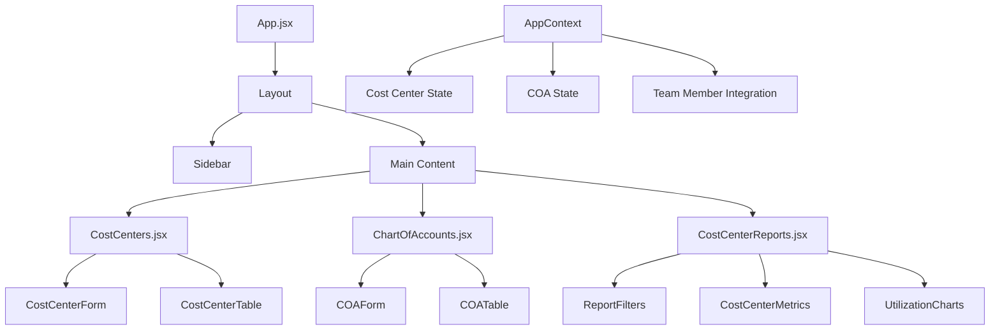

# Design Document: Cost Center Management

## Overview

The Cost Center Management feature extends the existing IT resource management application with comprehensive cost center tracking and monitoring capabilities. This feature integrates seamlessly with the current React-based architecture, leveraging existing patterns for CRUD operations, state management, and UI components.

The design builds upon the existing foundation where cost centers and Chart of Accounts (COA) data are already defined in the application's default data structure. The feature will provide full CRUD operations for both cost centers and COA entries, integrate cost center assignments with team members, and deliver powerful reporting capabilities for cost tracking and analysis.

## Architecture

### Integration with Existing System

The Cost Center Management feature integrates with the existing application architecture:

- **State Management**: Extends the existing AppContext with new actions and state for cost centers and COA
- **Navigation**: Adds new menu items to the Configuration section of the sidebar
- **Data Persistence**: Utilizes the existing localStorage-based persistence system
- **UI Components**: Leverages the established component library and design patterns
- **Routing**: Extends the existing React Router configuration with new routes

### Component Architecture



### Data Flow

1. **CRUD Operations**: User interactions trigger dispatch actions to AppContext
2. **State Updates**: Context reducer updates state and triggers localStorage persistence
3. **Auto-recalculation**: Changes to cost centers trigger recalculation of affected allocations
4. **UI Updates**: React re-renders components based on state changes
5. **Integration**: Team member assignments automatically link to cost center data

## Components and Interfaces

### Core Components

#### CostCenters.jsx
Primary CRUD interface for cost center management following the established library page pattern with shadcn/ui components:

- **Layout**: Uses the established `library-page` CSS class with `animate-in fade-in duration-500` animations
- **Header Section**: Glass effect card with icon, title, description, and primary action button following the TeamMembers pattern
- **Table Display**: TanStack Table with shadcn/ui Table components for sorting, filtering, and pagination
- **Form Modal**: shadcn/ui Dialog component with DialogContent, DialogHeader, DialogFooter for add/edit operations
- **Validation**: Client-side validation with error display using shadcn/ui form patterns
- **Actions**: Edit and delete buttons using shadcn/ui Button with ghost variant and appropriate hover states
- **Search/Filter**: shadcn/ui Input with Search icon and muted background following existing filter patterns
- **Status Badges**: shadcn/ui Badge components with appropriate variants for Active/Inactive status

#### ChartOfAccounts.jsx
CRUD interface for COA management with similar shadcn/ui patterns:

- **Layout**: Follows the same library page structure with animated entry and glass effect cards
- **Category Organization**: Groups accounts by expense categories using shadcn/ui Accordion or Tabs components
- **Code Validation**: Real-time validation with shadcn/ui form error states and appropriate error messaging
- **Referential Integrity**: Uses shadcn/ui Alert components for warnings about deletion prevention
- **Bulk Operations**: shadcn/ui Checkbox components for selection with bulk action buttons
- **Import/Export**: shadcn/ui Button components with appropriate icons for file operations

#### CostCenterReports.jsx
Comprehensive reporting and analytics dashboard using shadcn/ui components:

- **Layout**: Multi-column grid layout with shadcn/ui Card components for different report sections
- **Utilization Metrics**: Progress components and Badge elements for showing resource allocation percentages
- **Cost Analysis**: Uses shadcn/ui Table for detailed cost breakdowns with proper typography classes
- **Interactive Charts**: Integration with chart library (recharts) wrapped in shadcn/ui Card components
- **Export Functionality**: shadcn/ui DropdownMenu for export options (PDF, CSV) with appropriate icons
- **Date Range Filtering**: shadcn/ui DatePicker components for configurable reporting periods
- **Loading States**: shadcn/ui Skeleton components for loading states during report generation

### Data Models

#### Cost Center Model
```typescript
interface CostCenter {
  id: string;              // Unique identifier (CC-XXX format)
  code: string;            // Short organizational code (e.g., "ENG", "PROD")
  name: string;            // Display name (e.g., "Engineering")
  description: string;     // Detailed description
  manager: string;         // Manager name or ID
  status: 'Active' | 'Inactive';
  createdAt: Date;
  updatedAt: Date;
  // Optional fields for future expansion
  parentCostCenter?: string;
  budgetLimit?: number;
  approvalRequired?: boolean;
}
```

#### Chart of Accounts Model
```typescript
interface ChartOfAccount {
  id: string;              // Unique identifier (COA-XXXX format)
  code: string;            // Account code (e.g., "5001", "6002")
  name: string;            // Account name (e.g., "Basic Salary")
  category: 'Expense' | 'Revenue' | 'Asset' | 'Liability';
  description: string;     // Detailed description
  isActive: boolean;
  createdAt: Date;
  updatedAt: Date;
  // Optional fields for future expansion
  parentAccount?: string;
  taxCategory?: string;
}
```

#### Enhanced Team Member Model
```typescript
interface TeamMember {
  // Existing fields...
  id: string;
  name: string;
  type: string;
  maxHoursPerWeek: number;
  costTierId: string;
  isActive: boolean;
  
  // New cost center integration
  costCenterId?: string;   // Assigned cost center
  costCenterHistory?: {    // Historical assignments for audit
    costCenterId: string;
    assignedAt: Date;
    assignedBy: string;
  }[];
}
```

### State Management Extensions

#### AppContext Extensions
```typescript
// New state properties
interface AppState {
  // Existing state...
  costCenters: CostCenter[];
  chartOfAccounts: ChartOfAccount[];
  
  // Enhanced settings
  settings: {
    // Existing settings...
    costCenterSettings: {
      requireManagerApproval: boolean;
      allowBulkAssignment: boolean;
      trackAssignmentHistory: boolean;
    };
  };
}

// New action types
const NEW_ACTIONS = {
  // Cost Centers
  ADD_COST_CENTER: 'ADD_COST_CENTER',
  UPDATE_COST_CENTER: 'UPDATE_COST_CENTER',
  DELETE_COST_CENTER: 'DELETE_COST_CENTER',
  SET_COST_CENTERS: 'SET_COST_CENTERS',
  
  // Chart of Accounts
  ADD_COA: 'ADD_COA',
  UPDATE_COA: 'UPDATE_COA',
  DELETE_COA: 'DELETE_COA',
  SET_COA: 'SET_COA',
  
  // Team Member Cost Center Assignment
  ASSIGN_MEMBER_COST_CENTER: 'ASSIGN_MEMBER_COST_CENTER',
  BULK_ASSIGN_COST_CENTER: 'BULK_ASSIGN_COST_CENTER',
};
```

### Navigation Integration

#### Sidebar Updates
The Configuration section will be extended with new menu items using the existing navigation pattern:

```javascript
{
  title: 'Configuration',
  items: [
    { path: '/library/members', label: 'Team Members', icon: Users },
    { path: '/library/phases', label: 'Phases', icon: Layers },
    { path: '/library/tasks', label: 'Task Templates', icon: ListTodo },
    { path: '/library/complexity', label: 'Complexity', icon: SlidersHorizontal },
    { path: '/library/costs', label: 'Resource Costs', icon: Coins },
    // New cost center menu items with lucide-react icons
    { path: '/library/cost-centers', label: 'Cost Centers', icon: Building2 },
    { path: '/library/chart-of-accounts', label: 'Chart of Accounts', icon: Receipt },
  ],
},
```

**Icon Integration**: Uses lucide-react icons (Building2, Receipt) consistent with existing navigation
**Tooltip Support**: Integrates with existing TooltipProvider for collapsed sidebar state
**Active State**: Follows existing NavLink active state styling and hover effects

#### Routing Configuration
```javascript
// New routes in App.jsx
<Route path="library/cost-centers" element={<CostCenters />} />
<Route path="library/chart-of-accounts" element={<ChartOfAccounts />} />
<Route path="reports/cost-centers" element={<CostCenterReports />} />
```

## Data Models

### Cost Center Data Structure

The cost center model builds upon the existing `defaultCostCenters.js` structure with enhancements for full CRUD operations:

```javascript
// Enhanced cost center with additional metadata
const costCenter = {
  id: 'CC-001',                    // Auto-generated unique ID
  code: 'ENG',                     // Short organizational code
  name: 'Engineering',             // Display name
  description: 'Software development and infrastructure',
  manager: 'Alex Engineering',     // Manager name/reference
  status: 'Active',               // Active/Inactive status
  createdAt: '2024-01-15T10:00:00Z',
  updatedAt: '2024-01-15T10:00:00Z',
  
  // Optional future enhancements
  parentCostCenter: null,         // For hierarchical structures
  budgetLimit: 50000000,          // Monthly budget limit
  approvalRequired: false,        // Require approval for assignments
  
  // Calculated fields (computed at runtime)
  totalMembers: 5,               // Count of assigned team members
  totalMonthlyCost: 75000000,    // Sum of assigned member costs
  utilizationRate: 0.85,         // Percentage of capacity allocated
};
```

### Chart of Accounts Integration

Extends the existing `defaultCOA.js` with enhanced categorization and tracking:

```javascript
// Enhanced COA entry
const coaEntry = {
  id: 'COA-5001',                 // Auto-generated unique ID
  code: '5001',                   // Account code
  name: 'Basic Salary',           // Account name
  category: 'Expense',            // Expense/Revenue/Asset/Liability
  description: 'Base monthly salary for permanent employees',
  isActive: true,                 // Active status
  createdAt: '2024-01-15T10:00:00Z',
  updatedAt: '2024-01-15T10:00:00Z',
  
  // Optional enhancements
  parentAccount: null,            // For account hierarchies
  taxCategory: 'PERSONNEL',       // Tax classification
  
  // Usage tracking (computed)
  usageCount: 15,                // Number of transactions using this account
  lastUsed: '2024-01-20T14:30:00Z',
};
```

### Team Member Cost Center Assignment

Enhanced team member model with cost center integration:

```javascript
// Team member with cost center assignment
const teamMember = {
  // Existing fields
  id: 'MEM-001',
  name: 'Abdurrahman Hakim',
  type: 'FULLSTACK',
  maxHoursPerWeek: 40,
  costTierId: 'COST-FULL-2',
  isActive: true,
  
  // New cost center fields
  costCenterId: 'CC-001',         // Current cost center assignment
  costCenterAssignedAt: '2024-01-15T10:00:00Z',
  costCenterAssignedBy: 'admin',
  
  // Historical tracking
  costCenterHistory: [
    {
      costCenterId: 'CC-001',
      assignedAt: '2024-01-15T10:00:00Z',
      assignedBy: 'admin',
      unassignedAt: null,         // null if current assignment
    }
  ],
};
```

### Allocation Cost Center Integration

Enhanced allocation model to track cost center associations:

```javascript
// Allocation with cost center tracking
const allocation = {
  // Existing allocation fields...
  id: 'ALLOC-001',
  memberId: 'MEM-001',
  projectName: 'Project Alpha',
  
  // Cost center integration
  costCenterId: 'CC-001',         // Derived from team member assignment
  costCenterSnapshot: {           // Snapshot at allocation time
    id: 'CC-001',
    code: 'ENG',
    name: 'Engineering',
  },
  
  // Cost breakdown by cost center
  costBreakdown: {
    costCenterId: 'CC-001',
    monthlyCost: 14000000,
    dailyCost: 700000,
    hourlyCost: 87500,
  },
};
```

## Correctness Properties

*A property is a characteristic or behavior that should hold true across all valid executions of a system-essentially, a formal statement about what the system should do. Properties serve as the bridge between human-readable specifications and machine-verifiable correctness guarantees.*

Based on the prework analysis of acceptance criteria, the following properties ensure the correctness of the Cost Center Management system:

### Property 1: Cost Center CRUD Validation
*For any* cost center creation or update operation, the system should validate all required fields (code, name, manager), enforce unique codes, generate unique IDs for new entries, and preserve IDs during updates while updating timestamps.
**Validates: Requirements 1.1, 1.3, 8.1, 8.5**

### Property 2: COA CRUD Validation  
*For any* Chart of Accounts entry creation or update, the system should validate account code format, ensure code uniqueness, support standard expense categories, and maintain referential integrity with existing allocations.
**Validates: Requirements 2.1, 2.3, 2.5**

### Property 3: Referential Integrity Protection
*For any* deletion attempt on cost centers or COA entries, if active references exist (team member assignments or transactions), the system should prevent deletion and provide appropriate warnings or suggestions.
**Validates: Requirements 1.4, 2.4, 8.3**

### Property 4: Team Member Cost Center Assignment
*For any* team member cost center assignment or change, the system should update the association immediately, maintain historical records for audit purposes, and trigger recalculation of affected project allocations.
**Validates: Requirements 3.1, 3.3, 5.4, 7.3**

### Property 5: Cost Calculation Accuracy
*For any* project allocation or cost center report generation, the system should accurately calculate costs using current team member assignments, aggregate expenses by cost center, and include all relevant cost components (personnel, allocations, expenses).
**Validates: Requirements 3.4, 4.1, 5.1, 5.3**

### Property 6: Display Completeness
*For any* cost center list, COA list, team member details, or allocation details view, the system should display all required information fields as specified in the requirements (codes, names, managers, statuses, cost center associations).
**Validates: Requirements 1.2, 2.2, 3.2, 5.2**

### Property 7: Report Filtering and Metrics
*For any* cost center report with date range filters, the system should include only data within the specified period and provide accurate metrics including utilization rates, total costs, and active team member counts.
**Validates: Requirements 4.2, 4.3, 4.4**

### Property 8: Data Persistence Round Trip
*For any* cost center or COA data modification, saving to local storage and subsequent application reload should restore the exact same data state.
**Validates: Requirements 7.1, 7.2**

### Property 9: Bulk Operations Consistency
*For any* bulk assignment of team members to cost centers, all selected members should be assigned to the target cost center with consistent timestamps and proper validation.
**Validates: Requirements 3.5**

### Property 10: Export Data Integrity
*For any* cost center report export operation, the exported file (CSV or PDF) should contain the same data as displayed in the application interface.
**Validates: Requirements 4.5**

### Property 11: Navigation Integration
*For any* user accessing the Configuration section, the cost center menu options should be displayed alongside existing library items and navigation should load the correct data.
**Validates: Requirements 6.1, 6.2**

### Property 12: User Feedback Consistency
*For any* CRUD operation (create, update, delete) on cost centers or COA entries, the system should provide immediate feedback through toast notifications.
**Validates: Requirements 6.3**

### Property 13: Data Migration Preservation
*For any* data migration operation, existing cost center and COA data should be preserved while new schema fields are added without data loss.
**Validates: Requirements 7.4**

### Property 14: Hierarchical Structure Validation
*For any* cost center hierarchy update, the system should prevent circular references and maintain valid organizational structure.
**Validates: Requirements 8.4**

## Error Handling

### Validation Errors
- **Required Field Validation**: Clear error messages for missing required fields (code, name, manager)
- **Uniqueness Validation**: Specific error messages when duplicate codes are detected
- **Format Validation**: Detailed feedback for invalid account code formats or naming convention violations
- **Manager Validation**: Clear error when assigned manager doesn't exist in team member list

### Referential Integrity Errors
- **Deletion Prevention**: Informative warnings when attempting to delete cost centers with active assignments
- **COA Reference Protection**: Clear messages when COA entries cannot be deleted due to existing transactions
- **Dependency Checking**: Comprehensive validation before deactivation operations

### System Errors
- **Storage Failures**: Graceful handling of localStorage quota exceeded or access denied
- **Migration Errors**: Rollback capabilities and error reporting for failed data migrations
- **Calculation Errors**: Fallback mechanisms for cost calculation failures
- **Export Errors**: User-friendly messages for failed report generation or export operations

### User Experience Error Handling
- **Network Simulation**: Proper loading states and error boundaries for async operations
- **Form Validation**: Real-time validation feedback with clear correction guidance
- **Bulk Operation Errors**: Partial success reporting with details on failed items
- **Concurrent Modification**: Conflict resolution for simultaneous edits

## Testing Strategy

### Dual Testing Approach

The Cost Center Management feature requires both unit testing and property-based testing for comprehensive coverage:

**Unit Tests** focus on:
- Specific examples of cost center and COA CRUD operations
- Edge cases like empty data sets, maximum field lengths, and boundary conditions
- Integration points between cost centers and existing team member/allocation systems
- Error conditions and validation scenarios
- UI component rendering and user interaction flows

**Property Tests** focus on:
- Universal properties that hold across all possible inputs and data combinations
- Comprehensive input coverage through randomized test data generation
- Validation of business rules across diverse cost center and COA configurations
- Data consistency and integrity across all operations

### Property-Based Testing Configuration

**Testing Library**: Use `fast-check` for JavaScript property-based testing
**Test Configuration**: Minimum 100 iterations per property test to ensure comprehensive coverage
**Test Tagging**: Each property test must reference its design document property using the format:
`// Feature: cost-center-management, Property X: [property description]`

### Property Test Implementation Requirements

Each correctness property must be implemented as a single property-based test:

1. **Property 1 Test**: Generate random cost center data and validate CRUD operations
2. **Property 2 Test**: Generate random COA entries and test validation rules
3. **Property 3 Test**: Create cost centers/COA with references and test deletion protection
4. **Property 4 Test**: Generate assignment scenarios and validate behavior
5. **Property 5 Test**: Create allocation scenarios and validate cost calculations
6. **Property 6 Test**: Generate display data and validate completeness
7. **Property 7 Test**: Generate report data with date ranges and validate filtering
8. **Property 8 Test**: Test persistence round-trip with random data modifications
9. **Property 9 Test**: Generate bulk assignment scenarios and validate consistency
10. **Property 10 Test**: Generate report data and validate export integrity
11. **Property 11 Test**: Test navigation integration with various data states
12. **Property 12 Test**: Test user feedback across all CRUD operations
13. **Property 13 Test**: Test migration scenarios with various data configurations
14. **Property 14 Test**: Generate hierarchy scenarios and validate structure rules

### Integration Testing

**Existing System Integration**:
- Verify cost center integration with existing team member management
- Test allocation system integration with cost center assignments
- Validate state management integration with existing AppContext patterns
- Ensure UI component integration follows established design patterns

**Cross-Feature Testing**:
- Test cost center changes impact on project cost calculations
- Verify team member cost center assignments affect allocation costs
- Validate report generation includes data from all integrated systems
- Test navigation and routing integration with existing application structure

### Performance Testing

**Data Volume Testing**:
- Test performance with large numbers of cost centers (100+)
- Validate COA management with extensive account hierarchies
- Test report generation with large datasets and complex filtering
- Verify bulk operations performance with many team members

**User Experience Testing**:
- Validate responsive design across different screen sizes
- Test keyboard navigation and accessibility compliance
- Verify loading states and error boundaries function correctly
- Test real-time filtering and search performance

### UI Component Specifications

#### Design System Compliance

All Cost Center Management components must follow the established design patterns:

**Animation System**:
- Use `animate-in fade-in duration-500` for page entry animations
- Apply `transition-all active:scale-95` for interactive button states
- Implement hover states with appropriate color transitions

**Typography**:
- Page titles: `text-2xl font-bold tracking-tight text-slate-900 dark:text-slate-100`
- Descriptions: `text-sm text-slate-500 font-medium dark:text-slate-400`
- Table headers: `text-[10px] font-bold text-slate-500 dark:text-slate-400 uppercase tracking-wider`
- Form labels: `text-[10px] font-bold text-slate-400 uppercase tracking-wider`

**Color Scheme**:
- Primary actions: Indigo color palette (`bg-indigo-600/10`, `text-indigo-600`)
- Success states: Emerald palette (`bg-emerald-500/10`, `text-emerald-600`)
- Warning/Error states: Red palette (`bg-red-600`, `hover:bg-red-700`)
- Neutral elements: Slate palette with appropriate opacity levels

**Component Styling**:
- Cards: `bg-card p-6 rounded-2xl border border-border shadow-sm`
- Buttons: `rounded-xl shadow-lg dark:shadow-none` for primary actions
- Form inputs: `rounded-lg` with focus states using `focus-visible:ring-indigo-500`
- Tables: Proper cell padding `py-3 px-4` with hover states

#### Responsive Design

**Mobile-First Approach**:
- Grid layouts: `grid-cols-1 lg:grid-cols-3` for responsive column layouts
- Flex layouts: `flex-col md:flex-row` for header sections
- Button groups: Stack vertically on mobile, horizontal on desktop
- Table responsiveness: Horizontal scroll on mobile with proper touch interactions

**Accessibility**:
- Proper ARIA labels for all interactive elements
- Keyboard navigation support for all CRUD operations
- Screen reader compatibility for table data and form validation
- Color contrast compliance for all text and background combinations

#### Form Design Patterns

**Modal Forms**:
- Use `DialogContent` with `sm:max-w-xl` for standard forms
- Grid layouts: `grid-cols-2 gap-4` for form fields
- Validation: Real-time error display with `border-red-500` for invalid fields
- Footer actions: `DialogFooter` with Cancel (ghost) and Submit (primary) buttons

**Inline Editing**:
- Follow existing patterns from TeamMembers and ResourceCosts pages
- Use Select components for dropdowns with proper placeholder text
- Implement proper loading states during save operations
- Provide immediate feedback through toast notifications

#### Data Display Patterns

**Table Design**:
- Follow TanStack Table patterns from existing library pages
- Use Badge components for status indicators with appropriate variants
- Implement proper sorting indicators and hover states
- Include action columns with edit/delete buttons using ghost variant

**Status Indicators**:
- Active/Inactive badges: `rounded-full px-2 py-0 text-[10px] uppercase font-bold`
- Color coding: Green for active, gray for inactive
- Consistent badge sizing and typography across all components

**Loading States**:
- Use shadcn/ui Skeleton components for table loading
- Implement proper loading spinners for async operations
- Provide loading text with appropriate messaging
- Maintain layout stability during loading transitions