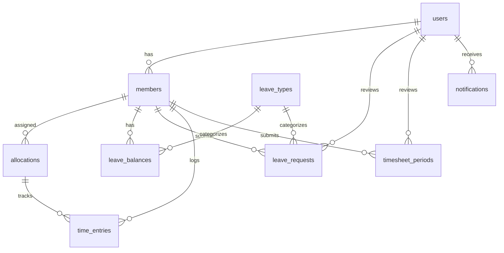

# Database Schema: HR Workload Enhancement

This document details the database models, relationships, and migrations for the enhancement project.

---

## Entity Relationship Diagram



---

## New Tables

### 1. `leave_types`

Leave categories that can be requested by members.

| Column | Type | Constraints | Description |
|--------|------|-------------|-------------|
| id | UUID | PK, DEFAULT gen_random_uuid() | Primary key |
| name | VARCHAR(100) | NOT NULL | Type name (Annual Leave, Sick Leave) |
| default_days | INTEGER | NOT NULL, DEFAULT 0 | Default annual entitlement |
| carry_over_max | INTEGER | NOT NULL, DEFAULT 0 | Max days to carry to next year |
| requires_approval | BOOLEAN | NOT NULL, DEFAULT TRUE | If false, auto-approve |
| color | VARCHAR(7) | DEFAULT '#3B82F6' | Hex color for calendar display |
| is_active | BOOLEAN | NOT NULL, DEFAULT TRUE | Soft delete flag |
| created_at | TIMESTAMP | DEFAULT NOW() | Record creation time |
| updated_at | TIMESTAMP | DEFAULT NOW() | Last update time |

**Indexes:**
- PRIMARY KEY on `id`

**Seed Data:**
```sql
INSERT INTO leave_types (name, default_days, carry_over_max, color) VALUES
  ('Annual Leave', 20, 5, '#22C55E'),
  ('Sick Leave', 10, 0, '#EF4444'),
  ('Personal Leave', 3, 0, '#8B5CF6'),
  ('Unpaid Leave', 0, 0, '#6B7280');
```

---

### 2. `leave_balances`

Tracks leave entitlement and usage per member per year.

| Column | Type | Constraints | Description |
|--------|------|-------------|-------------|
| id | UUID | PK | Primary key |
| member_id | UUID | FK → members, NOT NULL | Member reference |
| leave_type_id | UUID | FK → leave_types, NOT NULL | Leave type reference |
| year | INTEGER | NOT NULL | Calendar year |
| total_days | DECIMAL(4,1) | NOT NULL, DEFAULT 0 | Total entitlement |
| used_days | DECIMAL(4,1) | NOT NULL, DEFAULT 0 | Days already taken |
| created_at | TIMESTAMP | DEFAULT NOW() | Record creation time |
| updated_at | TIMESTAMP | DEFAULT NOW() | Last update time |

**Indexes:**
- PRIMARY KEY on `id`
- UNIQUE on `(member_id, leave_type_id, year)`
- INDEX on `member_id`

**Computed Fields:**
- `remaining_days` = `total_days` - `used_days`
- `pending_days` = SUM of pending leave requests for this balance

---

### 3. `leave_requests`

Individual leave requests submitted by members.

| Column | Type | Constraints | Description |
|--------|------|-------------|-------------|
| id | UUID | PK | Primary key |
| member_id | UUID | FK → members, NOT NULL | Requesting member |
| leave_type_id | UUID | FK → leave_types, NOT NULL | Leave type |
| start_date | DATE | NOT NULL | First day of leave |
| end_date | DATE | NOT NULL | Last day of leave |
| days | DECIMAL(4,1) | NOT NULL | Calculated work days |
| half_day | VARCHAR(10) | DEFAULT 'FULL' | 'FULL', 'AM', or 'PM' |
| reason | TEXT | | Reason for leave |
| status | VARCHAR(20) | NOT NULL, DEFAULT 'PENDING' | Request status |
| reviewed_by | UUID | FK → users | Approving/rejecting user |
| reviewed_at | TIMESTAMP | | When reviewed |
| rejection_reason | TEXT | | Reason if rejected |
| created_at | TIMESTAMP | DEFAULT NOW() | Submission time |
| updated_at | TIMESTAMP | DEFAULT NOW() | Last update time |

**Status Values:**
- `PENDING` - Awaiting review
- `APPROVED` - Request approved
- `REJECTED` - Request rejected
- `CANCELLED` - Cancelled by member

**Indexes:**
- PRIMARY KEY on `id`
- INDEX on `member_id`
- INDEX on `status`
- INDEX on `(start_date, end_date)`
- INDEX on `leave_type_id`

---

### 4. `time_entries`

Individual time log entries against allocations.

| Column | Type | Constraints | Description |
|--------|------|-------------|-------------|
| id | UUID | PK | Primary key |
| member_id | UUID | FK → members, NOT NULL | Member logging time |
| allocation_id | UUID | FK → allocations, NOT NULL | Task allocation |
| date | DATE | NOT NULL | Date of work |
| hours | DECIMAL(4,2) | NOT NULL | Hours worked |
| notes | TEXT | | Optional work description |
| created_at | TIMESTAMP | DEFAULT NOW() | Record creation time |
| updated_at | TIMESTAMP | DEFAULT NOW() | Last update time |

**Indexes:**
- PRIMARY KEY on `id`
- UNIQUE on `(member_id, allocation_id, date)`
- INDEX on `member_id`
- INDEX on `date`
- INDEX on `allocation_id`

---

### 5. `timesheet_periods`

Weekly timesheet submissions for approval.

| Column | Type | Constraints | Description |
|--------|------|-------------|-------------|
| id | UUID | PK | Primary key |
| member_id | UUID | FK → members, NOT NULL | Member submitting |
| week_start | DATE | NOT NULL | Monday of week |
| week_end | DATE | NOT NULL | Sunday of week |
| total_hours | DECIMAL(5,2) | NOT NULL, DEFAULT 0 | Sum of time entries |
| status | VARCHAR(20) | NOT NULL, DEFAULT 'DRAFT' | Submission status |
| submitted_at | TIMESTAMP | | When submitted |
| reviewed_by | UUID | FK → users | Reviewing admin |
| reviewed_at | TIMESTAMP | | When reviewed |
| rejection_reason | TEXT | | Reason if rejected |
| created_at | TIMESTAMP | DEFAULT NOW() | Record creation time |
| updated_at | TIMESTAMP | DEFAULT NOW() | Last update time |

**Status Values:**
- `DRAFT` - Not yet submitted
- `SUBMITTED` - Awaiting review
- `APPROVED` - Timesheet approved
- `REJECTED` - Rejected, needs revision

**Indexes:**
- PRIMARY KEY on `id`
- UNIQUE on `(member_id, week_start)`
- INDEX on `status`

---

### 6. `notifications`

In-app notifications for users.

| Column | Type | Constraints | Description |
|--------|------|-------------|-------------|
| id | UUID | PK | Primary key |
| user_id | UUID | FK → users, NOT NULL | Recipient user |
| type | VARCHAR(50) | NOT NULL | Notification type code |
| title | VARCHAR(255) | NOT NULL | Notification title |
| message | TEXT | | Full message content |
| link | VARCHAR(500) | | Optional click action URL |
| is_read | BOOLEAN | NOT NULL, DEFAULT FALSE | Read status |
| created_at | TIMESTAMP | DEFAULT NOW() | Notification time |

**Type Values:**
- `LEAVE_REQUEST` - New leave request (to admin)
- `LEAVE_APPROVED` - Leave approved (to member)
- `LEAVE_REJECTED` - Leave rejected (to member)
- `TASK_ASSIGNED` - New task assigned (to member)
- `TASK_DUE_SOON` - Task due soon (to member)
- `TIMESHEET_REMINDER` - Weekly reminder (to member)
- `TIMESHEET_SUBMITTED` - Timesheet submitted (to admin)
- `TIMESHEET_APPROVED` - Timesheet approved (to member)
- `TIMESHEET_REJECTED` - Timesheet rejected (to member)

**Indexes:**
- PRIMARY KEY on `id`
- INDEX on `user_id`
- INDEX on `(user_id, is_read)`
- INDEX on `created_at`

---

## Table Modifications

### `allocations` (Existing Table)

Add the following columns:

| Column | Type | Constraints | Description |
|--------|------|-------------|-------------|
| status | VARCHAR(20) | DEFAULT 'NOT_STARTED' | Task status |
| status_updated_at | TIMESTAMP | | When status last changed |
| progress | INTEGER | DEFAULT 0 | Progress percentage 0-100 |

**Status Values:**
- `NOT_STARTED` - Task not begun (Gray)
- `IN_PROGRESS` - Currently working (Blue)
- `ON_HOLD` - Temporarily paused (Yellow)
- `COMPLETED` - Finished (Green)

**New Index:**
- INDEX on `status`

---

## Sequelize Model Definitions

### LeaveType Model

```javascript
// backend/src/models/LeaveType.js
module.exports = (sequelize, DataTypes) => {
  const LeaveType = sequelize.define('LeaveType', {
    id: {
      type: DataTypes.UUID,
      defaultValue: DataTypes.UUIDV4,
      primaryKey: true
    },
    name: {
      type: DataTypes.STRING(100),
      allowNull: false
    },
    defaultDays: {
      type: DataTypes.INTEGER,
      allowNull: false,
      defaultValue: 0
    },
    carryOverMax: {
      type: DataTypes.INTEGER,
      allowNull: false,
      defaultValue: 0
    },
    requiresApproval: {
      type: DataTypes.BOOLEAN,
      allowNull: false,
      defaultValue: true
    },
    color: {
      type: DataTypes.STRING(7),
      defaultValue: '#3B82F6'
    },
    isActive: {
      type: DataTypes.BOOLEAN,
      allowNull: false,
      defaultValue: true
    }
  }, {
    tableName: 'leave_types',
    underscored: true
  });

  LeaveType.associate = (models) => {
    LeaveType.hasMany(models.LeaveBalance, { foreignKey: 'leaveTypeId' });
    LeaveType.hasMany(models.LeaveRequest, { foreignKey: 'leaveTypeId' });
  };

  return LeaveType;
};
```

### LeaveBalance Model

```javascript
// backend/src/models/LeaveBalance.js
module.exports = (sequelize, DataTypes) => {
  const LeaveBalance = sequelize.define('LeaveBalance', {
    id: {
      type: DataTypes.UUID,
      defaultValue: DataTypes.UUIDV4,
      primaryKey: true
    },
    memberId: {
      type: DataTypes.UUID,
      allowNull: false
    },
    leaveTypeId: {
      type: DataTypes.UUID,
      allowNull: false
    },
    year: {
      type: DataTypes.INTEGER,
      allowNull: false
    },
    totalDays: {
      type: DataTypes.DECIMAL(4, 1),
      allowNull: false,
      defaultValue: 0
    },
    usedDays: {
      type: DataTypes.DECIMAL(4, 1),
      allowNull: false,
      defaultValue: 0
    }
  }, {
    tableName: 'leave_balances',
    underscored: true,
    indexes: [
      { unique: true, fields: ['member_id', 'leave_type_id', 'year'] }
    ]
  });

  LeaveBalance.associate = (models) => {
    LeaveBalance.belongsTo(models.Member, { foreignKey: 'memberId' });
    LeaveBalance.belongsTo(models.LeaveType, { foreignKey: 'leaveTypeId' });
  };

  return LeaveBalance;
};
```

### LeaveRequest Model

```javascript
// backend/src/models/LeaveRequest.js
module.exports = (sequelize, DataTypes) => {
  const LeaveRequest = sequelize.define('LeaveRequest', {
    id: {
      type: DataTypes.UUID,
      defaultValue: DataTypes.UUIDV4,
      primaryKey: true
    },
    memberId: {
      type: DataTypes.UUID,
      allowNull: false
    },
    leaveTypeId: {
      type: DataTypes.UUID,
      allowNull: false
    },
    startDate: {
      type: DataTypes.DATEONLY,
      allowNull: false
    },
    endDate: {
      type: DataTypes.DATEONLY,
      allowNull: false
    },
    days: {
      type: DataTypes.DECIMAL(4, 1),
      allowNull: false
    },
    halfDay: {
      type: DataTypes.ENUM('FULL', 'AM', 'PM'),
      defaultValue: 'FULL'
    },
    reason: {
      type: DataTypes.TEXT
    },
    status: {
      type: DataTypes.ENUM('PENDING', 'APPROVED', 'REJECTED', 'CANCELLED'),
      allowNull: false,
      defaultValue: 'PENDING'
    },
    reviewedBy: {
      type: DataTypes.UUID
    },
    reviewedAt: {
      type: DataTypes.DATE
    },
    rejectionReason: {
      type: DataTypes.TEXT
    }
  }, {
    tableName: 'leave_requests',
    underscored: true
  });

  LeaveRequest.associate = (models) => {
    LeaveRequest.belongsTo(models.Member, { foreignKey: 'memberId' });
    LeaveRequest.belongsTo(models.LeaveType, { foreignKey: 'leaveTypeId' });
    LeaveRequest.belongsTo(models.User, { as: 'reviewer', foreignKey: 'reviewedBy' });
  };

  return LeaveRequest;
};
```

---

## Migration Files

### Migration 1: Create Leave Types

```javascript
// YYYYMMDDHHMMSS-create-leave-types.js
'use strict';

module.exports = {
  async up(queryInterface, Sequelize) {
    await queryInterface.createTable('leave_types', {
      id: {
        type: Sequelize.UUID,
        defaultValue: Sequelize.literal('gen_random_uuid()'),
        primaryKey: true
      },
      name: {
        type: Sequelize.STRING(100),
        allowNull: false
      },
      default_days: {
        type: Sequelize.INTEGER,
        allowNull: false,
        defaultValue: 0
      },
      carry_over_max: {
        type: Sequelize.INTEGER,
        allowNull: false,
        defaultValue: 0
      },
      requires_approval: {
        type: Sequelize.BOOLEAN,
        allowNull: false,
        defaultValue: true
      },
      color: {
        type: Sequelize.STRING(7),
        defaultValue: '#3B82F6'
      },
      is_active: {
        type: Sequelize.BOOLEAN,
        allowNull: false,
        defaultValue: true
      },
      created_at: {
        type: Sequelize.DATE,
        defaultValue: Sequelize.literal('NOW()')
      },
      updated_at: {
        type: Sequelize.DATE,
        defaultValue: Sequelize.literal('NOW()')
      }
    });

    // Seed default leave types
    await queryInterface.bulkInsert('leave_types', [
      { 
        id: Sequelize.literal('gen_random_uuid()'),
        name: 'Annual Leave', 
        default_days: 20, 
        carry_over_max: 5, 
        color: '#22C55E',
        requires_approval: true,
        is_active: true,
        created_at: new Date(),
        updated_at: new Date()
      },
      { 
        id: Sequelize.literal('gen_random_uuid()'),
        name: 'Sick Leave', 
        default_days: 10, 
        carry_over_max: 0, 
        color: '#EF4444',
        requires_approval: true,
        is_active: true,
        created_at: new Date(),
        updated_at: new Date()
      },
      { 
        id: Sequelize.literal('gen_random_uuid()'),
        name: 'Personal Leave', 
        default_days: 3, 
        carry_over_max: 0, 
        color: '#8B5CF6',
        requires_approval: true,
        is_active: true,
        created_at: new Date(),
        updated_at: new Date()
      }
    ]);
  },

  async down(queryInterface) {
    await queryInterface.dropTable('leave_types');
  }
};
```

---

## Data Seeding for Testing

```javascript
// backend/src/seeders/YYYYMMDDHHMMSS-demo-leave-data.js
'use strict';

module.exports = {
  async up(queryInterface) {
    // Get member IDs and leave type IDs
    const members = await queryInterface.sequelize.query(
      'SELECT id FROM members LIMIT 5',
      { type: queryInterface.sequelize.QueryTypes.SELECT }
    );
    
    const leaveTypes = await queryInterface.sequelize.query(
      'SELECT id FROM leave_types',
      { type: queryInterface.sequelize.QueryTypes.SELECT }
    );
    
    const currentYear = new Date().getFullYear();
    
    // Create leave balances for each member and leave type
    const balances = [];
    for (const member of members) {
      for (const type of leaveTypes) {
        balances.push({
          member_id: member.id,
          leave_type_id: type.id,
          year: currentYear,
          total_days: type.default_days || 20,
          used_days: Math.floor(Math.random() * 10),
          created_at: new Date(),
          updated_at: new Date()
        });
      }
    }
    
    await queryInterface.bulkInsert('leave_balances', balances);
  },

  async down(queryInterface) {
    await queryInterface.bulkDelete('leave_balances', null, {});
  }
};
```
