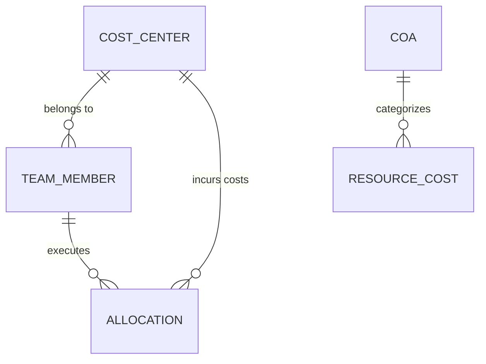

# Cost Center Management & Chart of Accounts (COA) Research

## Overview
This document outlines the research for implementing Cost Center Management and Chart of Accounts (COA) within the HR/Workload Management application.

## 1. Concept Definitions

### Cost Center (Pusat Biaya)
A Cost Center is a department or function within an organization that does not directly add to profit but still costs the organization money to operate.
- **Goal:** Track expenses by organizational unit.
- **Common Properties:**
    - `Code`: Unique identifier (e.g., CC-IT-01).
    - `Name`: Department name (e.g., Information Technology).
    - `Description`: Brief description of the unit.
    - `Manager`: Person responsible for the budget.
    - `Parent Cost Center`: For hierarchical structures.
    - `Status`: Active or Inactive.

### Chart of Accounts (COA)
A Chart of Accounts is an index of all the financial accounts in the general ledger of a company.
- **Goal:** Categorize every financial transaction.
- **Common Types in HR context:**
    - `5000-5999`: Personal Expenses (Salaries, Benefits, Bonuses).
    - `6000-6999`: Operational Expenses (Software Licenses, Office Supplies).
- **Common Properties:**
    - `Account Code`: Numerical code (e.g., 5001).
    - `Account Name`: Name (e.g., Basic Salary).
    - `Category`: Asset, Liability, Revenue, Expense.
    - `Description`: Usage guidelines.

## 2. Integration into current application

Based on the existing codebase (e.g., `ResourceAllocation`, `ResourceCosts`):

### Mapping Structures
1. **Team Members to Cost Centers:** Every employee should belong to a primary Cost Center.
2. **Resource Costs to COA Account:** The salary/rate for a role tier should be mapped to a specific COA account.
3. **Allocations to Cost Centers:** Project allocations can be tracked against the Cost Center of the employee or the Project itself.

### Data Relationships

## 3. Implementation Ideas
- **Library Section:** Add "Cost Centers" and "COA" as sub-menus under Configuration.
- **Settings:** Add default COA mapping for different role types.
- **Reports:** (Future) Add a dashboard to see costs per Cost Center.
