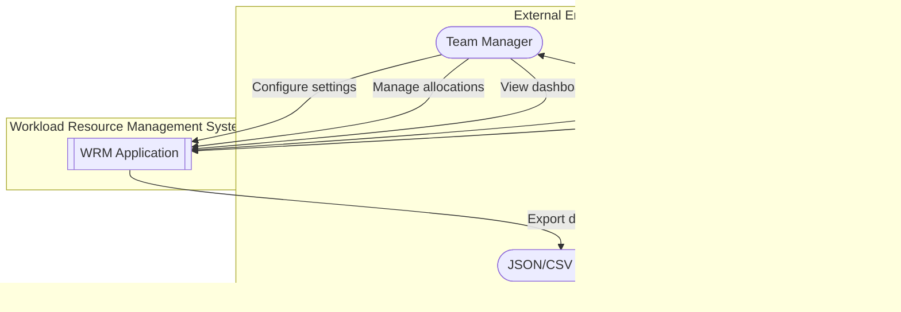

# Workload Resource Management - Architecture

This document contains all system diagrams, data relationships, and architectural decisions for the Workload Resource Management application.

---

## Table of Contents

1. [System Overview](#system-overview)
2. [Entity Relationship Diagram](#entity-relationship-diagram)
3. [Data Flow Diagrams](#data-flow-diagrams)
4. [Data Schemas](#data-schemas)
5. [LocalStorage Structure](#localstorage-structure)
6. [Calculation Formulas](#calculation-formulas)
7. [Project Structure](#project-structure)

---

## System Overview

### Tech Stack

| Layer | Technology |
|-------|------------|
| **Framework** | React 18 + Vite 5 |
| **Routing** | React Router v6 |
| **State Management** | React Context + useReducer |
| **Styling** | CSS Modules + CSS Variables |
| **Charts** | Recharts |
| **Date Utilities** | date-fns |
| **Data Persistence** | LocalStorage |
| **Deployment** | GitHub Pages (gh-pages) |

### Application Modules

```
┌─────────────────────────────────────────────────────────────────┐
│                    Workload Resource Management                  │
├─────────────────────────────────────────────────────────────────┤
│                                                                  │
│  ┌──────────────┐  ┌──────────────┐  ┌──────────────────────┐  │
│  │   Library    │  │  Important   │  │      Resource        │  │
│  │   (Config)   │  │    Dates     │  │     Allocation       │  │
│  ├──────────────┤  ├──────────────┤  ├──────────────────────┤  │
│  │ Team Members │  │ Holidays     │  │ Allocation Table     │  │
│  │ Phases       │  │ Leave Plans  │  │ Auto-calculations    │  │
│  │ Tasks        │  │              │  │ CRUD Operations      │  │
│  │ Complexity   │  │              │  │                      │  │
│  │ Costs        │  │              │  │                      │  │
│  └──────────────┘  └──────────────┘  └──────────────────────┘  │
│                                                                  │
│  ┌──────────────────────────────────────────────────────────┐   │
│  │                  Workload Summary Dashboard              │   │
│  ├──────────────────────────────────────────────────────────┤   │
│  │ Top 5 Tasks per Member │ Task Matrix │ Charts & Stats    │   │
│  └──────────────────────────────────────────────────────────┘   │
│                                                                  │
└─────────────────────────────────────────────────────────────────┘
```

---

## Entity Relationship Diagram

### Core Entities


### Entity Relationships Summary

| Parent Entity | Child Entity | Relationship | Description |
|--------------|--------------|--------------|-------------|
| `ResourceCost` | `TeamMember` | One-to-Many | One cost tier can apply to multiple team members |
| `TeamMember` | `Leave` | One-to-Many | One member can have multiple leave records |
| `TeamMember` | `Allocation` | One-to-Many | One member can have multiple task allocations |
| `Phase` | `TaskTemplate` | One-to-Many | One phase contains multiple task templates |
| `TaskTemplate` | `Allocation` | One-to-Many | One task template can be used in multiple allocations |
| `TaskComplexity` | `Allocation` | One-to-Many | One complexity level can apply to multiple allocations |
| `Holiday` | `Allocation` | Many-to-Many | Holidays affect workload calculations for all allocations |
| `Allocation` | `PlanDates` | One-to-One | Each allocation has one set of planned dates |
| `Allocation` | `ActualDates` | One-to-Zero/One | Allocation may or may not have actual dates yet |
| `Allocation` | `WorkloadCalc` | One-to-One | Each allocation has computed workload metrics |

---

## Data Flow Diagrams

### Level 0: Context Diagram



---

### Level 1: Main Process Flow


---

### Level 2: Library (Config) Module Flow


---

### Level 2: Resource Allocation Flow


---

### Level 2: Workload Calculation Detail


---

### Level 2: Workload Summary Dashboard Flow


---

### Level 2: Important Dates Flow


---

### Level 2: Cost Calculation Flow


---

## Data Schemas

### Team Member

```javascript
{
  id: "R1",                    // ResourceID
  name: "Beatrix",             // Full name
  type: "BA",                  // BA or PM
  maxHoursPerWeek: 40,         // Max work hours
  costTierId: "beatrix",       // Link to resource cost
  isActive: true,
  createdAt: "2026-01-06T10:00:00Z"
}
```

### Phase

```javascript
{
  id: 1,                       // Phase number
  name: "Requirement Gathering & Analysis",
  tasks: ["T001", "T002"],     // Task IDs in this phase
  sortOrder: 1,
  isTerminal: false            // true for Idle/Completed
}
```

### Task Template

```javascript
{
  id: "T001",
  name: "Stakeholder Interviews",
  phaseId: 1,
  estimates: {
    low: { days: 2, hours: 1, percentage: 0.125 },
    medium: { days: 5, hours: 2, percentage: 0.25 },
    high: { days: 10, hours: 4, percentage: 0.5 }
  }
}
```

### Complexity

```javascript
{
  low: {
    level: "low",
    days: 27,
    hours: 14.5,
    workload: 2.446875,
    color: "#10b981"
  },
  medium: {
    level: "medium",
    days: 72,
    hours: 19,
    workload: 8.55,
    color: "#3b82f6"
  },
  high: {
    level: "high",
    days: 102,
    hours: 30,
    workload: 19.125,
    color: "#f59e0b"
  }
}
```

### Resource Cost

```javascript
{
  id: "beatrix",
  resourceName: "Beatrix",
  monthlyCost: 1000000,        // IDR
  perDayCost: 50000,           // IDR
  perHourCost: 6250,           // IDR
  currency: "IDR"
}
```

### Holiday

```javascript
{
  id: "hd_001",
  date: "2025-01-01",
  name: "New Year's Day",
  type: "national",
  year: 2025
}
```

### Leave

```javascript
{
  id: "lv_001",
  memberId: "R1",
  memberName: "Beatrix",
  date: "2025-03-20"
}
```

### Allocation (Complete)

```javascript
{
  id: "alloc_001",
  
  // Core fields
  activityName: "SMART ACTIVE NEW TOC",
  resource: "Care BA",
  category: "High",
  phase: "Completed",
  taskName: "Completed",
  
  // Plan section
  plan: {
    taskStart: "2025-02-12",
    taskEnd: "2025-07-22",      // Auto-calculated
    costProject: 375000,        // Auto-calculated
    costMonthly: 75000          // Auto-calculated
  },
  
  // Actual section
  actual: {
    taskStart: "2025-02-12",
    taskEnd: "2025-05-12"
  },
  
  workload: 0,                  // Auto-calculated
  remarks: "",
  
  createdAt: "2026-01-06T10:00:00Z",
  updatedAt: "2026-01-06T10:00:00Z"
}
```

---

## LocalStorage Structure

| Key | Data Type | Description |
|-----|-----------|-------------|
| `wrm_members` | `TeamMember[]` | All team members |
| `wrm_phases` | `Phase[]` | All phases with task references |
| `wrm_tasks` | `TaskTemplate[]` | All task templates with estimates |
| `wrm_complexity` | `Object` | Complexity settings (low, medium, high) |
| `wrm_costs` | `ResourceCost[]` | All resource cost tiers |
| `wrm_holidays` | `Holiday[]` | National and company holidays |
| `wrm_leaves` | `Leave[]` | All team member leaves |
| `wrm_allocations` | `Allocation[]` | All resource allocations |
| `wrm_settings` | `Object` | App settings (theme, currency, etc.) |
| `wrm_version` | `string` | Data schema version for migrations |

---

## Calculation Formulas

### 1. Plan Task End Date (WORKDAY)

```javascript
function calculatePlanEndDate(startDate, complexity, resourceName, holidays, leaves) {
  const durationDays = complexitySettings[complexity].days;
  const memberLeaves = leaves.filter(l => l.memberName === resourceName);
  const excludedDates = [
    ...holidays.map(h => h.date),
    ...memberLeaves.map(l => l.date)
  ];
  return addWorkdays(startDate, durationDays, excludedDates);
}
```

### 2. Project Cost

```javascript
function calculateProjectCost(complexity, resourceName, complexitySettings, resourceCosts) {
  const workload = complexitySettings[complexity].workload;
  const resource = resourceCosts.find(r => r.name === resourceName);
  return workload * resource.perHourCost;
}
```

### 3. Monthly Cost

```javascript
function calculateMonthlyCost(projectCost, startDate, endDate) {
  const months = differenceInMonths(endDate, startDate) || 1;
  return projectCost / months;
}
```

### 4. Workload Percentage

```javascript
function calculateWorkloadPercentage(taskName, complexity, taskTemplates) {
  const task = taskTemplates.find(t => t.name === taskName);
  if (!task) return 0;
  return task.estimates[complexity.toLowerCase()].percentage;
}
```

### 5. Task Matrix Count (COUNTIFS)

```javascript
function countTasksByMember(taskName, memberName, allocations) {
  return allocations.filter(a => 
    a.taskName === taskName && a.resource === memberName
  ).length;
}
```

### 6. Total Workload per Member (SUMIFS)

```javascript
function getTotalWorkload(memberName, allocations) {
  return allocations
    .filter(a => a.resource === memberName)
    .reduce((sum, a) => sum + a.workload, 0);
}
```

---

## Project Structure

```
hr-management/
├── index.html
├── package.json
├── vite.config.js
├── docs/
│   ├── ARCHITECTURE.md          # This file
│   ├── TASKS.md                 # Task breakdown
│   └── IMPLEMENTATION_PLAN.md   # Full implementation plan
├── src/
│   ├── main.jsx
│   ├── App.jsx
│   ├── App.css
│   ├── index.css
│   │
│   ├── context/
│   │   └── AppContext.jsx
│   │
│   ├── hooks/
│   │   ├── useLocalStorage.js
│   │   └── useCalculations.js
│   │
│   ├── utils/
│   │   ├── storage.js
│   │   ├── calculations.js
│   │   └── dates.js
│   │
│   ├── data/
│   │   ├── indonesiaHolidays.js
│   │   ├── defaultTeam.js
│   │   ├── defaultPhases.js
│   │   ├── defaultTasks.js
│   │   └── defaultCosts.js
│   │
│   ├── components/
│   │   ├── layout/
│   │   │   ├── Sidebar.jsx
│   │   │   ├── Header.jsx
│   │   │   └── Layout.jsx
│   │   ├── ui/
│   │   │   ├── Button.jsx
│   │   │   ├── Input.jsx
│   │   │   ├── Select.jsx
│   │   │   ├── Modal.jsx
│   │   │   ├── Card.jsx
│   │   │   ├── Table.jsx
│   │   │   ├── DatePicker.jsx
│   │   │   └── Badge.jsx
│   │   └── charts/
│   │       ├── WorkloadChart.jsx
│   │       ├── CostChart.jsx
│   │       └── TaskMatrix.jsx
│   │
│   └── pages/
│       ├── WorkloadSummary.jsx
│       ├── ResourceAllocation.jsx
│       ├── ImportantDates.jsx
│       └── Library/
│           ├── index.jsx
│           ├── TeamMembers.jsx
│           ├── Phases.jsx
│           ├── TaskTemplates.jsx
│           ├── Complexity.jsx
│           └── ResourceCosts.jsx
│
└── public/
    └── favicon.svg
```

---

## Future Architecture: Skill-Based Matching


