# Workload Resource Management Web App

A comprehensive web application for tracking and managing team workload, resource allocation, and daily performance metrics.

---

## Overview

### Problem Statement
Managing team workload requires tracking multiple dimensions: task categories, complexity levels, resource costs, important dates, and individual team member allocations. This app provides a unified solution to manage all these aspects without requiring a backend database.

### Key Features
1. **Configuration Management** - Set up task categories, complexity levels, costs, holidays, and team members
2. **Resource Allocation Tracking** - Plan and track actual task assignments with workload calculations
3. **Workload Summary Dashboard** - Visual overview of team workload and resource utilization

### Technical Approach
- **Framework**: React 18 + Vite (fast, modern, excellent DX)
- **Routing**: React Router v6 (client-side routing)
- **State Management**: React Context + useReducer (simple, no extra dependencies)
- **Styling**: CSS Modules + CSS Variables (scoped styles, design tokens)
- **Charts**: Recharts (React-native charting library)
- **Data Storage**: LocalStorage for persistence + JSON import/export
- **Deployment**: GitHub Pages via `gh-pages` package

---

## Excel Prototype Analysis

Based on your `WorkloadResources.xlsx`, here's the structure I'll replicate:

### Sheets Found
| Sheet Name | Purpose |
|------------|---------|
| **WorkloadSummary** | Dashboard showing top 5 tasks per team member + task allocation matrix |
| **ResourceAllocation** | Main allocation table with Plan/Actual dates and costs |
| **ImportantDate** | Indonesian holidays (2025) + Team leave plans |
| **Library** | Config data: Team members, Phases, Tasks, Complexity levels, Resource costs |

### Existing Team Members (from Library sheet)
| Resource ID | Name | Type | Max Hours/Week |
|-------------|------|------|----------------|
| R1 | Beatrix | BA | 40 |
| R2 | Herindra | BA | 40 |
| R3 | Care BA | BA | 40 |
| R4 | Azdan | BA | 40 |
| R5 | Laili | BA | 40 |
| R6 | Cici | PM | 40 |
| R7 | Yosy | PM | 40 |

### Existing Resource Costs (from Library sheet)
| Resource | Monthly Cost (IDR) | Per Day (IDR) | Per Hour (IDR) |
|----------|-------------------|---------------|----------------|
| CARE BA | 2,000,000 | 100,000 | 12,500 |
| Herindra | 2,500,000 | 125,000 | 15,625 |
| Beatrix | 1,000,000 | 50,000 | 6,250 |
| Azdan | 2,100,000 | 105,000 | 13,125 |
| Laili | 1,900,000 | 95,000 | 11,875 |

### Existing Task Phases (from Library sheet)
| No | Phase | Tasks |
|----|-------|-------|
| 1 | Requirement Gathering & Analysis | Stakeholder Interviews, Requirements Documentation |
| 2 | Design | UI/UX Design, System Functional Design |
| 3 | Implementation | Test Case Creation, Frontend & Backend Development |
| 4 | Testing | Integration Testing, User Acceptance Test |
| 5 | Deployment | Deployment to Production |
| 6 | Maintenance | Post-Deployment Support |
| 7 | Idle | Idle |
| 8 | Completed | Completed |

### Existing Complexity Levels (from Library sheet)
| Complexity | Duration (Days) | Duration (Hours) | Cycle Activity | Percentage Range |
|------------|-----------------|------------------|----------------|------------------|
| **Low** | 27 | 14.5 | 2.446875 | 6.25% - 37.5% |
| **Medium** | 72 | 19 | 8.55 | 12.5% - 37.5% |
| **High** | 102 | 30 | 19.125 | 12.5% - 50% |

### Pre-loaded Indonesian Holidays 2025
| Date | Name |
|------|------|
| 2025-01-01 | New Year's Day |
| 2025-01-27 | Isra Mi'raj |
| 2025-01-29 | Chinese New Year |
| 2025-03-29 | Bali Hindu New Year (Silence Day) |
| 2025-03-31 | Eid al-Fitr |
| 2025-04-01 | Eid al-Fitr |
| 2025-04-02 | Mass Leave Eid al-Fitr |
| 2025-04-03 | Mass Leave Eid al-Fitr |
| 2025-04-04 | Mass Leave Eid al-Fitr |
| 2025-04-07 | Mass Leave Eid al-Fitr |
| 2025-04-18 | Good Friday |
| 2025-04-20 | Easter Sunday |
| 2025-05-01 | Labour Day |
| 2025-05-12 | Waisak Day |
| 2025-05-29 | Ascension Day of Jesus Christ |
| 2025-06-01 | Pancasila Day |
| 2025-06-06 | Eid al-Adha |
| 2025-06-27 | Islamic New Year |
| 2025-08-17 | Independence Day |
| 2025-09-05 | Prophet Muhammad's Birthday |
| 2025-12-25 | Christmas Day |

---

## Excel Formulas Extracted

### Named Ranges (from Library sheet)
| Name | Reference | Description |
|------|-----------|-------------|
| `LibsTask` | `Library!$J$3:$J$14` | Task names list |
| `LibsPhase` | `Library!$H$3:$H$14` | Phase names list |
| `LowPct` | `Library!$M$3:$M$14` | Low complexity percentages per task |
| `MediumPct` | `Library!$P$3:$P$14` | Medium complexity percentages per task |
| `HighPct` | `Library!$S$3:$S$14` | High complexity percentages per task |

---

### Formula 1: Plan Task End Date (Auto-calculated)

**Excel Formula:**
```excel
=IFNA(
  WORKDAY(
    F3,                                           -- Plan TaskStart
    XLOOKUP(C3, Library!$V$3:$V$5, Library!$W$3:$W$5),  -- Duration days based on complexity
    VSTACK(
      ImportantDate!B3:B23,                       -- National holidays
      IFERROR(
        FILTER(ImportantDate!$F$3:$F$100, ImportantDate!$E$3:$E$100=B3),  -- Member leaves
        "1-Jan-2025"
      )
    )
  ),
  ""
)
```

**Logic:**
1. Takes `Plan TaskStart` date
2. Looks up complexity (Low/Medium/High) to get duration in working days from Library
3. Uses `WORKDAY` function to calculate end date, excluding:
   - National holidays (ImportantDate column B)
   - Team member's specific leaves (filtered by member name)

**JavaScript Equivalent:**
```javascript
function calculatePlanEndDate(startDate, complexity, resourceName, holidays, leaves) {
  const durationDays = complexitySettings[complexity].days;
  const memberLeaves = leaves.filter(l => l.memberName === resourceName);
  const excludedDates = [
    ...holidays.map(h => h.date),
    ...memberLeaves.map(l => l.date)
  ];
  return addWorkdays(startDate, durationDays, excludedDates);
}
```

---

### Formula 2: Cost Project (Auto-calculated)

**Excel Formula:**
```excel
=XLOOKUP(C3, Library!$V$3:$V$5, Library!$X$3:$X$5)  -- Cycle days for complexity
 * XLOOKUP(B3, Library!$B$22:$B$26, Library!$F$22:$F$26)  -- Per hour cost for resource
```

**Logic:**
1. Look up complexity level → get "cycle of activity" days value
2. Look up resource name → get per hour cost
3. Multiply: `cycleDays × perHourCost`

**JavaScript Equivalent:**
```javascript
function calculateProjectCost(complexity, resourceName, complexitySettings, resourceCosts) {
  const workload = complexitySettings[complexity].workload;
  const resource = resourceCosts.find(r => r.name === resourceName);
  return workload * resource.perHourCost;
}
```

---

### Formula 3: Cost Monthly (Auto-calculated)

**Excel Formula:**
```excel
=H3 / DATEDIF(F3, G3, "m")
```

**Logic:**
- Divides `Cost Project` by number of months between `Plan TaskStart` and `Plan TaskEnd`

**JavaScript Equivalent:**
```javascript
function calculateMonthlyCost(projectCost, startDate, endDate) {
  const months = differenceInMonths(endDate, startDate) || 1;
  return projectCost / months;
}
```

---

### Formula 4: Workload Percentage (Auto-calculated)

**Excel Formula:**
```excel
=XLOOKUP(E3, LibsTask, IF(C3="Low", LowPct, IF(C3="Medium", MediumPct, HighPct)))
```

**Logic:**
1. Look up current `TaskName` in LibsTask
2. Based on `Category` (complexity), select the corresponding percentage column

**Task Percentage Matrix (from Library):**
| Task Name | Low % | Medium % | High % |
|-----------|-------|----------|--------|
| Stakeholder Interviews | 12.5% | 25% | 50% |
| Requirements Documentation | 25% | 37.5% | 50% |
| UI/UX Design | 12.5% | 25% | 37.5% |
| System Functional Design | 12.5% | 12.5% | 25% |
| Test Case Creation | 25% | 25% | 50% |
| Frontend & Backend Development | 12.5% | 12.5% | 50% |
| Integration Testing | 25% | 25% | 37.5% |
| User Acceptance Test | 37.5% | 37.5% | 37.5% |
| Deployment to Production | 12.5% | 25% | 25% |
| Post-Deployment Support | 6.25% | 12.5% | 12.5% |
| Idle | 0% | 0% | 0% |
| Completed | 0% | 0% | 0% |

**JavaScript Equivalent:**
```javascript
function calculateWorkloadPercentage(taskName, complexity, taskTemplates) {
  const task = taskTemplates.find(t => t.name === taskName);
  if (!task) return 0;
  return task.estimates[complexity.toLowerCase()].percentage;
}
```

---

### Formula 5: Working Days Count (ImportantDate sheet)

**Excel Formula:**
```excel
=NETWORKDAYS(H2, H3, B3:B23)
```

**JavaScript Equivalent:**
```javascript
function countWorkdays(startDate, endDate, holidays) {
  let count = 0;
  let current = new Date(startDate);
  while (current <= endDate) {
    const dayOfWeek = current.getDay();
    const isWeekend = dayOfWeek === 0 || dayOfWeek === 6;
    const isHoliday = holidays.some(h => isSameDay(h.date, current));
    if (!isWeekend && !isHoliday) count++;
    current.setDate(current.getDate() + 1);
  }
  return count;
}
```

---

### Formula 6: Workload Summary - Task Matrix (COUNTIFS)

**Excel Formula:**
```excel
=COUNTIFS(
  ResourceAllocation!$E:$E, WorkloadSummary!$B14,  -- Match TaskName
  ResourceAllocation!B:B, WorkloadSummary!C$13     -- Match Resource
)
```

**JavaScript Equivalent:**
```javascript
function countTasksByMember(taskName, memberName, allocations) {
  return allocations.filter(a => 
    a.taskName === taskName && a.resource === memberName
  ).length;
}
```

---

### Formula 7: Workload Summary - Total Workload per Member

**Excel Formula:**
```excel
=SUMIFS(
  ResourceAllocation!$L$3:$L$24,   -- Sum Workload column
  ResourceAllocation!$B$3:$B$24,   -- Where Resource matches
  WorkloadSummary!C13              -- Member name
)
```

**JavaScript Equivalent:**
```javascript
function getTotalWorkload(memberName, allocations) {
  return allocations
    .filter(a => a.resource === memberName)
    .reduce((sum, a) => sum + a.workload, 0);
}
```

---

### Formula 8: Active Workload Percentage

**Excel Formula:**
```excel
=SUMIFS(
  ResourceAllocation!I3:I23,                    -- Sum Cost Monthly
  ResourceAllocation!B3:B23,                    -- Where Resource matches
  WorkloadSummary!C13,                          -- Member name
  ResourceAllocation!E3:E23,                    -- Where TaskName
  "<>Completed"                                 -- Is NOT "Completed"
) / XLOOKUP(WorkloadSummary!C13, Library!$B$22:$B$26, Library!$C$22:$C$26)
```

**JavaScript Equivalent:**
```javascript
function getActiveWorkloadRatio(memberName, allocations, resourceCosts) {
  const activeMonthlyCost = allocations
    .filter(a => a.resource === memberName && a.taskName !== 'Completed')
    .reduce((sum, a) => sum + a.plan.costMonthly, 0);
  const resource = resourceCosts.find(r => r.name === memberName);
  return activeMonthlyCost / resource.monthlyCost;
}
```

---

## Entity Relationship Diagram (ERD)


---

## Data Relationships Summary

| Parent Entity | Child Entity | Relationship | Description |
|--------------|--------------|--------------|-------------|
| `ResourceCost` | `TeamMember` | One-to-Many | One cost tier can apply to multiple team members |
| `TeamMember` | `Leave` | One-to-Many | One member can have multiple leave records |
| `TeamMember` | `Allocation` | One-to-Many | One member can have multiple task allocations |
| `Phase` | `TaskTemplate` | One-to-Many | One phase contains multiple task templates |
| `TaskTemplate` | `Allocation` | One-to-Many | One task template can be used in multiple allocations |
| `TaskComplexity` | `Allocation` | One-to-Many | One complexity level can apply to multiple allocations |
| `Holiday` | `Allocation` | Many-to-Many (implicit) | Holidays affect workload calculations for all allocations |
| `Allocation` | `PlanDates` | One-to-One | Each allocation has one set of planned dates |
| `Allocation` | `ActualDates` | One-to-Zero/One | Allocation may or may not have actual dates yet |
| `Allocation` | `WorkloadCalc` | One-to-One | Each allocation has computed workload metrics |

---

## Detailed Data Flow Diagrams

### Level 0: Context Diagram


---

### Level 1: Main Process Flow


---

### Level 2: Library (Config) Module Flow


---

### Level 2: Resource Allocation Flow

```mermaid
flowchart TB
    subgraph Input["Input Fields (matching Excel)"]
        I1[Activity Name]
        I2[Resource - Team Member]
        I3[Category - Complexity]
        I4[Phase - Current Status]
        I5[Task Name - Current Task]
        I6[Plan TaskStart]
        I7[Actual TaskStart]
        I8[Actual TaskEnd]
        I9[Remarks]
    end
    
    subgraph AutoCalc["Auto-Calculated Fields"]
        C1["Plan TaskEnd<br/>=WORKDAY(Start, Days, Holidays+Leaves)"]
        C2["Cost Project<br/>=Workload × HourlyRate"]
        C3["Cost Monthly<br/>=CostProject / Months"]
        C4["Workload %<br/>=XLOOKUP(Task → ComplexityPct)"]
    end
    
    subgraph Dependencies["Lookup Data"]
        D1[(Team Members)]
        D2[(Resource Costs)]
        D3[(Complexity Settings)]
        D4[(Holidays)]
        D5[(Leaves)]
        D6[(Task Templates)]
    end
    
    subgraph Output["Output"]
        O1[Allocation Record]
        O2[Updated Table Row]
    end
    
    I1 & I2 & I3 & I4 & I5 --> O1
    I6 --> C1
    I7 & I8 --> O1
    I9 --> O1
    
    I3 --> C1 & C2
    I2 --> C1 & C2
    D3 --> C1 & C2
    D4 & D5 --> C1
    D2 --> C2
    C1 --> C3
    C2 --> C3
    I5 --> C4
    D6 --> C4
    
    C1 & C2 & C3 & C4 --> O1
    O1 --> O2
```



---

### Level 2: Workload Calculation Detail

```mermaid
flowchart TB
    subgraph Inputs["Calculation Inputs"]
        A[Allocation Record]
        M[Team Member]
        H[Holidays in Period]
        L[Leaves in Period]
        CX[Complexity Settings]
    end
    
    subgraph Step1["Step 1: Calculate End Date"]
        S1A["Get Plan TaskStart"]
        S1B["Lookup complexity → days"]
        S1C["Get holidays list"]
        S1D["Filter member leaves"]
        S1E["WORKDAY calculation"]
        S1F["Result: Plan TaskEnd"]
    end
    
    subgraph Step2["Step 2: Calculate Project Cost"]
        S2A["Lookup complexity → workload"]
        S2B["Lookup resource → perHourCost"]
        S2C["Multiply: cycle × hourly"]
        S2D["Result: Cost Project"]
    end
    
    subgraph Step3["Step 3: Calculate Monthly Cost"]
        S3A["Get date range months"]
        S3B["Cost Project / Months"]
        S3C["Result: Cost Monthly"]
    end
    
    subgraph Step4["Step 4: Calculate Workload %"]
        S4A["Lookup TaskName in templates"]
        S4B["Select complexity column"]
        S4C["Result: Workload Percentage"]
    end
    
    A --> S1A
    CX --> S1B
    H --> S1C
    L --> S1D
    M --> S1D
    S1A --> S1E
    S1B --> S1E
    S1C --> S1E
    S1D --> S1E
    S1E --> S1F
    
    CX --> S2A
    M --> S2B
    S2A --> S2C
    S2B --> S2C
    S2C --> S2D
    
    S1A --> S3A
    S1F --> S3A
    S2D --> S3B
    S3A --> S3B
    S3B --> S3C
    
    A --> S4A
    CX --> S4B
    S4A --> S4C
    S4B --> S4C
```



---

### Level 2: Workload Summary Dashboard Flow


---

### Level 2: Important Dates Flow


---

### Level 2: Cost Calculation Flow


---

## Detailed Data Schemas

### 1. Team Member Schema
```javascript
{
  id: "R1",                    // ResourceID from Excel
  name: "Beatrix",             // ResourceName
  type: "BA",                  // Type (BA/PM)
  maxHoursPerWeek: 40,         // Max Hours / Week
  costTierId: "beatrix",       // Link to resource cost
  isActive: true,
  createdAt: "2026-01-06T10:00:00Z"
}
```

### 2. Phase Schema
```javascript
{
  id: 1,                       // No from Excel
  name: "Requirement Gathering & Analysis",
  tasks: ["T001", "T002"],     // Task IDs in this phase
  sortOrder: 1,
  isTerminal: false            // true for Idle/Completed
}
```

### 3. Task Template Schema
```javascript
{
  id: "T001",                  // Task ID from Excel
  name: "Stakeholder Interviews",
  phaseId: 1,
  estimates: {
    low: { days: 2, hours: 1, percentage: 0.125 },
    medium: { days: 5, hours: 2, percentage: 0.25 },
    high: { days: 10, hours: 4, percentage: 0.5 }
  }
}
```

### 4. Complexity Schema
```javascript
{
  low: {
    level: "low",
    days: 27,
    hours: 14.5,
    workload: 2.446875,
    color: "#10b981"
  },
  medium: {
    level: "medium",
    days: 72,
    hours: 19,
    workload: 8.55,
    color: "#3b82f6"
  },
  high: {
    level: "high",
    days: 102,
    hours: 30,
    workload: 19.125,
    color: "#f59e0b"
  }
}
```

### 5. Resource Cost Schema
```javascript
{
  id: "beatrix",
  resourceName: "Beatrix",
  monthlyCost: 1000000,        // Cost column
  perDayCost: 50000,           // Per day cost
  perHourCost: 6250,           // Per hour cost
  currency: "IDR"
}
```

### 6. Holiday Schema
```javascript
{
  id: "hd_001",
  date: "2025-01-01",
  name: "New Year's Day",
  type: "national",
  year: 2025
}
```

### 7. Leave Schema
```javascript
{
  id: "lv_001",
  memberId: "R1",
  memberName: "Beatrix",
  date: "2025-03-20"
}
```

### 8. Allocation Schema (Complete - Matching Excel)
```javascript
{
  id: "alloc_001",
  
  // Core fields (Excel columns)
  activityName: "SMART ACTIVE NEW TOC",    // ActivityName
  resource: "Care BA",                      // Resource
  category: "High",                         // Category (complexity)
  phase: "Completed",                       // Phase
  taskName: "Completed",                    // TaskName
  
  // Plan section (some auto-calculated)
  plan: {
    taskStart: "2025-02-12",               // Plan TaskStart (user input)
    taskEnd: "2025-07-22",                 // Plan TaskEnd (AUTO: WORKDAY formula)
    costProject: 375000,                   // Cost Project (AUTO: complexity × hourly)
    costMonthly: 75000                     // Cost monthly (AUTO: project / months)
  },
  
  // Actual section
  actual: {
    taskStart: "2025-02-12",               // Actual TaskStart
    taskEnd: "2025-05-12"                  // Actual TaskEnd
  },
  
  // Calculated
  workload: 0,                             // Workload (AUTO: XLOOKUP task → %)
  remarks: "",                             // Remarks
  
  createdAt: "2026-01-06T10:00:00Z",
  updatedAt: "2026-01-06T10:00:00Z"
}
```

---

## LocalStorage Key Structure

| Key | Data Type | Description |
|-----|-----------|-------------|
| `wrm_members` | `TeamMember[]` | All team members |
| `wrm_phases` | `Phase[]` | All phases with task references |
| `wrm_tasks` | `TaskTemplate[]` | All task templates with estimates |
| `wrm_complexity` | `Object` | Complexity settings (low, medium, high) |
| `wrm_costs` | `ResourceCost[]` | All resource cost tiers |
| `wrm_holidays` | `Holiday[]` | National and company holidays |
| `wrm_leaves` | `Leave[]` | All team member leaves |
| `wrm_allocations` | `Allocation[]` | All resource allocations |
| `wrm_settings` | `Object` | App settings (theme, currency, etc.) |
| `wrm_version` | `string` | Data schema version for migrations |

---

## UI Matching Excel Structure

### Page 1: Workload Summary (WorkloadSummary sheet)

**Section 1: Top 5 Tasks per Team Member**
```
┌────────────────────────────────────────────────────────────────────────────┐
│  Name      │ First Task        │ Second Task       │ Third Task          │
│            │ Task Name │ Date  │ Task Name │ Date  │ Task Name │ Date    │
├────────────┼───────────┼───────┼───────────┼───────┼───────────┼─────────┤
│  Beatrix   │ CHISS     │ 05/28 │ Fasttrack │ 04/16 │ Date Pay  │ 02/12   │
│  Herindra  │ BCAF Auto │ 05/23 │ Data Anon │ 06/12 │ Param Adj │ 06/13   │
│  ...       │ ...       │ ...   │ ...       │ ...   │ ...       │ ...     │
└────────────────────────────────────────────────────────────────────────────┘
```

**Section 2: Task Allocation Matrix**
```
┌─────────────────────────────────────────────────────────────────────────────┐
│  Task                          │ Beatrix │ Herindra │ Azdan │ Laili │ ...  │
├────────────────────────────────┼─────────┼──────────┼───────┼───────┼──────┤
│  Stakeholder Interviews        │    0    │    0     │   0   │   0   │  0   │
│  Requirements Documentation    │    0    │    0     │   0   │   0   │  0   │
│  UI/UX Design                  │    0    │    0     │   0   │   0   │  0   │
│  ...                           │   ...   │   ...    │  ...  │  ...  │ ...  │
│  Completed                     │    6    │    4     │   8   │   2   │  0   │
│  Idle                          │    0    │    0     │   0   │   0   │  0   │
└─────────────────────────────────────────────────────────────────────────────┘
```

### Page 2: Resource Allocation (ResourceAllocation sheet)

```
┌────────────────────────────────────────────────────────────────────────────────────────────────────┐
│                                              PLAN                        │       ACTUAL           │
│ ActivityName     │ Resource │ Category │ Phase    │ TaskName │ Start   │ End     │ Cost    │ ... │
├──────────────────┼──────────┼──────────┼──────────┼──────────┼─────────┼─────────┼─────────┼─────┤
│ SMART ACTIVE TOC │ Care BA  │ High     │ Completed│ Completed│ 02/12/25│ 07/22/25│ 375,000 │ ... │
│ REVAMP VIA.COM   │ Care BA  │ Medium   │ Completed│ Completed│ 02/13/25│ 06/10/25│ 237,500 │ ... │
│ PA PLUS CLP      │ Azdan    │ Medium   │ Completed│ Completed│ 02/17/25│ 06/12/25│ 249,375 │ ... │
└────────────────────────────────────────────────────────────────────────────────────────────────────┘
```

### Page 3: Important Dates (ImportantDate sheet)

```
┌─────────────────────────────────────────────┐  ┌─────────────────────────────┐
│         Indonesia Public Holiday            │  │        Leave Plan           │
├─────────────────────────────────────────────┤  ├─────────────────────────────┤
│  Date       │ Holiday Name                  │  │  Name     │ Dates           │
├─────────────┼───────────────────────────────┤  ├───────────┼─────────────────┤
│  2025-01-01 │ New Year's Day                │  │  Beatrix  │ 2025-03-20      │
│  2025-01-27 │ Isra Mi'raj                   │  │  ...      │ ...             │
│  2025-01-29 │ Chinese New Year              │  │           │                 │
└─────────────────────────────────────────────┘  └─────────────────────────────┘
```

### Page 4: Library (Config)

Tabbed interface with sections for:
- Team Members (R1-R7)
- Phases (1-8)
- Task Templates (T001-T012)
- Complexity Levels (Low/Medium/High)
- Resource Costs

---

## Project Structure

```
hr-management/
├── index.html
├── package.json
├── vite.config.js
├── src/
│   ├── main.jsx
│   ├── App.jsx
│   ├── App.css
│   ├── index.css
│   │
│   ├── context/
│   │   └── AppContext.jsx          # Global state management
│   │
│   ├── hooks/
│   │   ├── useLocalStorage.js      # LocalStorage persistence hook
│   │   └── useCalculations.js      # Calculation functions hook
│   │
│   ├── utils/
│   │   ├── storage.js              # Import/export utilities
│   │   ├── calculations.js         # All formula implementations
│   │   └── dates.js                # Date utilities (WORKDAY, NETWORKDAYS)
│   │
│   ├── data/
│   │   ├── indonesiaHolidays.js    # Pre-loaded 2025 holidays
│   │   ├── defaultTeam.js          # Default team members (R1-R7)
│   │   ├── defaultPhases.js        # Default phases (1-8)
│   │   ├── defaultTasks.js         # Default task templates (T001-T012)
│   │   └── defaultCosts.js         # Default resource costs
│   │
│   ├── components/
│   │   ├── layout/
│   │   │   ├── Sidebar.jsx         # Navigation sidebar
│   │   │   ├── Header.jsx          # Top header
│   │   │   └── Layout.jsx          # Main layout wrapper
│   │   ├── ui/
│   │   │   ├── Button.jsx          # Button component
│   │   │   ├── Input.jsx           # Form input component
│   │   │   ├── Select.jsx          # Dropdown select
│   │   │   ├── Modal.jsx           # Modal dialog
│   │   │   ├── Card.jsx            # Card container
│   │   │   ├── Table.jsx           # Data table component
│   │   │   ├── DatePicker.jsx      # Date picker
│   │   │   └── Badge.jsx           # Status badges
│   │   └── charts/
│   │       ├── WorkloadChart.jsx   # Workload bar chart
│   │       ├── CostChart.jsx       # Cost trend chart
│   │       └── TaskMatrix.jsx      # Task × Member matrix
│   │
│   └── pages/
│       ├── WorkloadSummary.jsx     # Dashboard (Sheet 1)
│       ├── ResourceAllocation.jsx  # Allocation table (Sheet 2)
│       ├── ImportantDates.jsx      # Holidays & leaves (Sheet 3)
│       └── Library/                # Config pages (Sheet 4)
│           ├── index.jsx           # Library main with tabs
│           ├── TeamMembers.jsx     # Team member management
│           ├── Phases.jsx          # Phase management
│           ├── TaskTemplates.jsx   # Task template management
│           ├── Complexity.jsx      # Complexity settings
│           └── ResourceCosts.jsx   # Cost tier management
│
└── public/
    └── favicon.svg
```

---

## Verification Plan

### Automated Testing
```bash
npm run dev      # Development server
npm run build    # Production build
npm run preview  # Preview production
npm run deploy   # Deploy to GitHub Pages
```

### Formula Verification
1. Compare calculated Plan TaskEnd with Excel values
2. Verify Cost Project matches Excel (workload × perHourCost)
3. Verify Cost Monthly matches Excel (project / months)
4. Verify Workload % matches Excel lookup results
5. Test WORKDAY calculation with holidays and leaves

### Manual Verification Checklist
1. **Library pages**: Add, edit, delete all config items
2. **Resource Allocation**: Create entries, verify auto-calculations
3. **Workload Summary**: Verify matrix counts match allocations
4. **Important Dates**: Add holidays and leaves, verify they affect calculations
5. **Data Persistence**: Refresh page, verify data persists
6. **Import/Export**: Export to JSON, clear data, import back
7. **GitHub Pages**: Deploy and verify all features work

---

## Deployment

### GitHub Pages Setup
```bash
# Install dependencies
npm install

# Development
npm run dev

# Build for production
npm run build

# Deploy to GitHub Pages
npm run deploy
```

### Vite Configuration
```javascript
// vite.config.js
export default defineConfig({
  plugins: [react()],
  base: '/hr-management/',  // GitHub repo name
})
```

### Package.json Scripts
```json
{
  "scripts": {
    "dev": "vite",
    "build": "vite build",
    "preview": "vite preview",
    "predeploy": "npm run build",
    "deploy": "gh-pages -d dist"
  }
}
```

---

## Recommended Improvements

Based on research of industry best practices for workload resource management applications, here are recommended enhancements categorized by priority:

### 🚀 High Priority - Enhanced Visualizations

#### 1. Gantt Chart Timeline View
**Current Gap**: Excel only shows tabular data without visual timeline representation.

**Improvement**:
- Add interactive Gantt chart showing all allocations on a timeline
- Color-code by team member, phase, or complexity
- Show dependencies between related tasks
- Drag-and-drop to reschedule tasks
- Visual indicators for holidays and leaves


**Implementation**: Use `react-gantt-timeline` or custom SVG component

---

#### 2. Calendar View for Resource Scheduling
**Current Gap**: No calendar view to see daily/weekly resource availability.

**Improvement**:
- Monthly/weekly/daily calendar views
- Show team member availability at a glance
- Highlight holidays in red, leaves in orange
- Click to add/edit allocations directly
- Toggle between calendar and table views

**Implementation**: Use `react-big-calendar` or similar

---

#### 3. Workload Heatmap
**Current Gap**: Workload shown only as numbers, hard to identify patterns.

**Improvement**:
- Visual heatmap showing workload intensity over time
- Rows = team members, Columns = weeks/months
- Color gradient: Green (underload) → Yellow (optimal) → Red (overload)
- Hover to see detailed breakdown

```
        Jan W1  Jan W2  Jan W3  Jan W4  Feb W1  Feb W2
Beatrix   🟢      🟡      🟡      🔴      🔴      🟡
Herindra  🟡      🟡      🟢      🟢      🟡      🟡
Azdan     🔴      🔴      🟡      🟡      🟢      🟢
```

---

### 📊 High Priority - Additional KPIs & Metrics

#### 4. Utilization Rate Dashboard
**Current Gap**: Only workload percentage shown, no utilization tracking.

**New Metrics to Add**:
| Metric | Formula | Purpose |
|--------|---------|---------|
| **Utilization Rate** | (Billable Hours / Available Hours) × 100 | Track productive time usage |
| **Capacity Available** | Max Hours - Allocated Hours | See remaining capacity |
| **Overdue Tasks** | Count where Actual End > Plan End | Track delays |
| **On-Time Delivery %** | (On-time / Total Completed) × 100 | Measure reliability |
| **Average Task Duration** | Sum(Actual Days) / Count | Track efficiency |

**New Dashboard Cards**:
```
┌─────────────────┬─────────────────┬─────────────────┬─────────────────┐
│  Team Capacity  │  Avg Utilization│  Overdue Tasks  │  On-Time Rate   │
│     85%         │      72%        │       3         │      94%        │
│  ████████░░     │  ███████░░░     │   ⚠️ Warning    │   ✅ Good       │
└─────────────────┴─────────────────┴─────────────────┴─────────────────┘
```

---

#### 5. Planned vs Actual Comparison
**Current Gap**: Both recorded but not analyzed for variance.

**Improvement**:
- Variance analysis showing: `Actual - Planned`
- Positive variance (ahead of schedule) in green
- Negative variance (behind schedule) in red
- Track estimation accuracy over time
- Historical trend chart

**New Fields**:
```javascript
{
  variance: {
    days: actualDays - plannedDays,
    cost: actualCost - plannedCost,
    percentage: ((actual - planned) / planned) * 100
  }
}
```

---

### ⚠️ High Priority - Burnout Prevention & Alerts

#### 6. Workload Alert System
**Current Gap**: No proactive warnings for overloaded team members.

**Improvement**:
- Real-time alerts when workload exceeds thresholds
- Configurable thresholds (e.g., >85% = warning, >100% = critical)
- Dashboard notifications with recommended actions
- Email/browser notifications (optional)

**Alert Levels**:
| Level | Threshold | Color | Action |
|-------|-----------|-------|--------|
| Optimal | 50-75% | 🟢 Green | None |
| Elevated | 76-85% | 🟡 Yellow | Monitor |
| High | 86-100% | 🟠 Orange | Redistribute |
| Overload | >100% | 🔴 Red | Immediate action |

**Alert Component**:
```jsx
<AlertBanner type="warning">
  ⚠️ Beatrix is at 95% workload for February. 
  Consider redistributing tasks to Laili (45% capacity available).
</AlertBanner>
```

---

#### 7. Team Wellness Indicators
**Current Gap**: No consideration for employee well-being.

**New Features**:
- Track consecutive high-workload weeks
- Flag team members with >3 weeks of >80% workload
- Suggest mandatory breaks/leaves
- "Wellness Score" per team member

---

### 🎯 Medium Priority - Skill-Based Task Matching

#### 8. Skill Matrix & Matching
**Current Gap**: Tasks assigned by availability only, not skills.

**Improvement**:
- Add skills to team member profiles
- Define required skills for task templates
- Auto-suggest best-fit resources for tasks
- Identify skill gaps and training needs

**New Data Structures**:
```javascript
// Team Member with Skills
{
  id: "R1",
  name: "Beatrix",
  skills: [
    { name: "Business Analysis", level: "Expert" },
    { name: "SQL", level: "Intermediate" },
    { name: "Stakeholder Management", level: "Expert" }
  ]
}

// Task Template with Requirements
{
  id: "T001",
  name: "Stakeholder Interviews",
  requiredSkills: ["Business Analysis", "Stakeholder Management"]
}
```

**Skill Match Score**:
```
Score = (Matched Skills / Required Skills) × Weight by Skill Level
```

---

### 💰 Medium Priority - Enhanced Cost Management

#### 9. Budget Forecasting & Variance Dashboard
**Current Gap**: Cost calculated but no budget tracking or forecasting.

**Improvement**:
- Set project/monthly budgets
- Track actual spend vs budget
- Forecast remaining costs
- Variance analysis with alerts

**New Dashboard**:
```
┌─────────────────────────────────────────────────────────────────┐
│                    January 2026 Budget Overview                  │
├─────────────────────────────────────────────────────────────────┤
│  Budget:     IDR 50,000,000                                     │
│  Actual:     IDR 42,500,000  ████████████████░░░░ (85%)        │
│  Forecast:   IDR 48,200,000                                     │
│  Variance:   IDR +1,800,000 (Under Budget) ✅                   │
└─────────────────────────────────────────────────────────────────┘
```

---

#### 10. Cost Trend Analysis
**Improvement**:
- Line chart showing monthly costs over time
- Compare against budget line
- Identify cost spikes and causes
- Project future costs based on current allocations

---

### 📅 Medium Priority - Enhanced Date Management

#### 11. Leave Calendar Integration
**Current Gap**: Leaves entered manually, no calendar view.

**Improvement**:
- Interactive calendar for leave management
- Visual blocked periods per member
- Bulk leave entry (date ranges)
- Holiday import from Indonesian government calendar API

---

#### 12. Automatic Holiday Updates
**Improvement**:
- Pre-load holidays for multiple years (2025-2030)
- Option to fetch from public API
- Support for regional holidays

---

### 🔄 Medium Priority - Workflow Improvements

#### 13. Task Templates with Checklists
**Current Gap**: Tasks are just names, no detailed breakdowns.

**Improvement**:
- Add subtasks/checklist items to task templates
- Track completion percentage
- Standard operating procedures (SOPs) per task

---

#### 14. Task Dependencies
**Current Gap**: No way to show task relationships.

**Improvement**:
- Define predecessor/successor relationships
- Auto-adjust dates when dependencies change
- Critical path visualization
- Block task start until dependencies complete

---

### 📤 Low Priority - Import/Export Enhancements

#### 15. Excel Import/Export
**Current Gap**: Only JSON export planned.

**Improvement**:
- Import data from existing Excel files
- Export to Excel format (xlsx)
- Template generation for bulk data entry
- Map columns during import

---

#### 16. PDF Reports
**Improvement**:
- Generate PDF reports for:
  - Resource Allocation summary
  - Workload Summary dashboard
  - Cost analysis
  - Individual team member reports
- Scheduled report generation

---

### 🎨 Low Priority - UI/UX Enhancements

#### 17. Dark/Light Theme Toggle
**Improvement**:
- User preference saved to localStorage
- System preference detection
- Smooth transition animation

---

#### 18. Drag-and-Drop Resource Reallocation
**Improvement**:
- Drag tasks between team members
- Visual feedback during drag
- Auto-recalculate workloads
- Undo functionality

---

#### 19. Keyboard Shortcuts
**Improvement**:
- Quick navigation (G+D = Dashboard, G+A = Allocation)
- Quick actions (N = New allocation, E = Edit)
- Help modal showing all shortcuts

---

### 🔔 Low Priority - Notifications & Collaboration

#### 20. Activity Log / Audit Trail
**Improvement**:
- Track all changes to allocations
- Who changed what, when
- Rollback capability
- Filter by date/user/action

---

#### 21. Comments & Notes
**Improvement**:
- Add comments to allocations
- @mention team members
- Comment history

---

## Implementation Priority Matrix

| Feature | Impact | Effort | Priority |
|---------|--------|--------|----------|
| Gantt Chart Timeline | High | Medium | 🔴 P1 |
| Workload Alert System | High | Low | 🔴 P1 |
| Utilization Rate Dashboard | High | Low | 🔴 P1 |
| Planned vs Actual Variance | High | Low | 🔴 P1 |
| Calendar View | Medium | Medium | 🟡 P2 |
| Workload Heatmap | Medium | Medium | 🟡 P2 |
| Skill-Based Matching | Medium | High | 🟡 P2 |
| Budget Forecasting | Medium | Medium | 🟡 P2 |
| Excel Import/Export | Medium | Medium | 🟢 P3 |
| PDF Reports | Low | Medium | 🟢 P3 |
| Dark/Light Theme | Low | Low | 🟢 P3 |
| Activity Log | Low | Medium | 🟢 P3 |

---

## Suggested Phased Rollout

### Phase 1: MVP (Current Plan)
- ✅ All pages matching Excel structure
- ✅ All formulas implemented
- ✅ LocalStorage persistence
- ✅ GitHub Pages deployment

### Phase 2: Enhanced Analytics
- Utilization Rate Dashboard
- Planned vs Actual Variance
- Workload Heatmap
- Basic Alert System

### Phase 3: Visual Planning
- Gantt Chart Timeline
- Calendar View
- Drag-and-Drop Reallocation

### Phase 4: Advanced Features
- Skill-Based Matching
- Budget Forecasting
- Excel Import/Export
- PDF Reports

---

## New Entity for Skills (Future Enhancement)


---

## Summary

These improvements transform the basic Excel-based tracking into a comprehensive workload resource management platform with:

1. **Better Visualization** - Gantt charts, calendars, heatmaps
2. **Proactive Management** - Alerts, burnout prevention, forecasting
3. **Smarter Allocation** - Skill matching, optimization suggestions
4. **Deeper Insights** - KPIs, variance analysis, trend tracking
5. **Enhanced UX** - Modern interface, drag-and-drop, keyboard shortcuts

The phased approach allows delivering immediate value while building toward a fully-featured solution.
